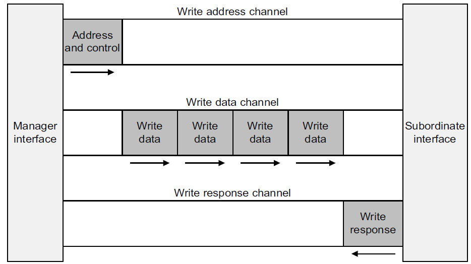
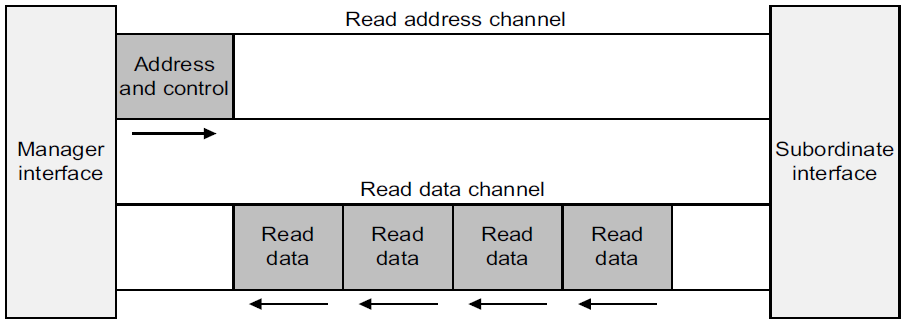
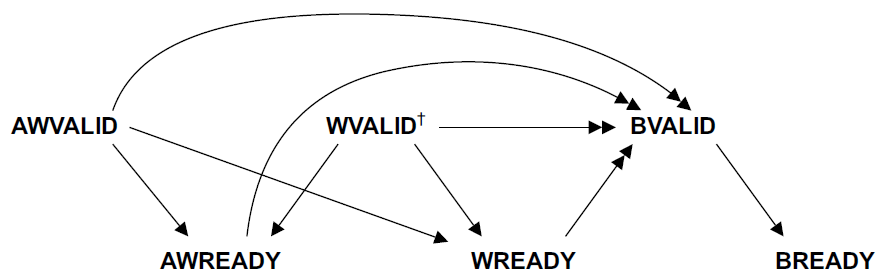

AXI4 接口共有五个通道，三个写通道，两个读通道。写通道中的写响应通道是单独一个通道，而读通道中的读响应和读数据合在了一个通道里。

<!--more-->

写通道：



读通道：



以下是握手信号的依赖关系：



箭头含义:
单箭头指向的信号可以在箭尾信号 assert 之前或之后 assert。
双箭头指向的信号必须在箭尾信号 assert 之后 assert。
即：
单箭头的箭头对箭尾没有依赖关系，所以箭尾不能等待箭头 assert，但箭头可以等待（也可以不等）箭尾 assert 。
双箭头的箭头依赖箭尾，所以箭头必须等待（全部）箭尾 assert 之后，才能 assert。

valid 信号不能等 ready 信号拉高之后再拉高。ready 信号可以等 valid 信号拉高之后再拉高。

本文从 Vivado 自动生成的 AXI4 master 接口代码的 always 块入手进行分析。


---

### 〇、AXI_master 接口以外信号

共三个：
INIT_AXI_TXN（input） —— 启动 transaction。
TXN_DONE（input） —— transaction 完成。
ERROR（output） —— 错误指示。

#### 0.1、INIT_AXI_TXN 信号打拍

INIT_AXI_TXN 信号是从外部输入到 AXI_master 模块的信号，用于使能一次传输，属于慢时钟域到快时钟域的跨时钟域信号，因此这里打两拍进行同步。

```verilog
always @(posedge M_AXI_ACLK) begin
        // Initiates AXI transaction delay
        if (M_AXI_ARESETN == 0 ) begin
            init_txn_ff <= 1'b0;
            init_txn_ff2 <= 1'b0;
        end
        else begin
            init_txn_ff <= INIT_AXI_TXN;
            init_txn_ff2 <= init_txn_ff;
        end
end
```

用打拍后的信号来提取使能信号的上升沿：

```verilog
assign init_txn_pulse   = (!init_txn_ff2) && init_txn_ff;
```

---

### 一、写地址通道（AW）

#### 1.1、awvalid 逻辑

awvalid 信号用于指示写地址通道的数据（地址）有效，与 awready 信号同为 1'b1 时握手成功。

```verilog
always @(posedge M_AXI_ACLK) begin
        if (M_AXI_ARESETN == 0 || init_txn_pulse == 1'b1 ) begin
                axi_awvalid <= 1'b0;
        end
        // If previously not valid , start next transaction
        else if (~axi_awvalid && start_single_burst_write) begin
                axi_awvalid <= 1'b1;
        end
        /* Once asserted, VALIDs cannot be deasserted, so axi_awvalid
        must wait until transaction is accepted */
        else if (M_AXI_AWREADY && axi_awvalid) begin
                axi_awvalid <= 1'b0;
        end
        else
            axi_awvalid <= axi_awvalid;
end
```

start_single_burst_write 为高，且 axi_awvalid 为低时，将 axi_awvalid 拉高，等待握手完成。

当 M_AXI_AWREADY 和 axi_awvalid 均为高电平时，将 axi_awvalid 拉低。也就是说，握手只持续一个时钟周期，数据（写通道的地址）只传送一次。且根据依赖关系，awvalid 不能等待 awready 拉高，而 awready 可以等待 awvalid 拉高。所以这里只要满足条件就拉高 awvalid，然后从机检测到 awvalid 拉高后，就将 awready 拉高进行握手。

start_single_burst_write 信号在状态机中进行修改：

```verilog
INIT_WRITE:
    // This state is responsible to issue start_single_write pulse to
    // initiate a write transaction. Write transactions will be
    // issued until burst_write_active signal is asserted.
    // write controller
    if (writes_done) begin
        mst_exec_state <= INIT_READ;//
    end
    else begin
        mst_exec_state  <= INIT_WRITE;
        
        if (~axi_awvalid && ~start_single_burst_write && ~burst_write_active) begin
            start_single_burst_write <= 1'b1;
        end
        else begin
            start_single_burst_write <= 1'b0; //Negate to generate a pulse
        end
    end
```

#### 1.2、awaddr 地址生成

当从机拉高 awready，意味着该次地址传输握手成功（因为 awvalid 一开始就在等待）。握手成功时，主机计算下一次 burst 的地址并赋给 awaddr。此时本次 burst 数据传输（写数据通道的传输）还没完成。


```verilog
always @(posedge M_AXI_ACLK) begin
    if (M_AXI_ARESETN == 0 || init_txn_pulse == 1'b1) begin
        axi_awaddr <= 'b0;
    end
    else if (M_AXI_AWREADY && axi_awvalid) begin
        axi_awaddr <= axi_awaddr + burst_size_bytes;
    end
    else
        axi_awaddr <= axi_awaddr;
end
```
另外，只有主机需要计算或从外部输入获取 awaddr 地址，从机只需要被动获取来自主机的 awaddr 即可。


---
### 二、写数据通道（W）

#### 2.1、写下一笔数据标志

```verilog
assign wnext = M_AXI_WREADY & axi_wvalid;
```

当 wvalid 和 wready 都为高时，说明握手成功，下一个数据可以继续传输，用 wnext 来表示。此时总线上的 wdata 已经完成一次传输。

#### 2.2、wvalid 逻辑

```verilog
always @(posedge M_AXI_ACLK) begin
    if (M_AXI_ARESETN == 0 || init_txn_pulse == 1'b1 ) begin
        axi_wvalid <= 1'b0;
    end
    // If previously not valid, start next transaction
    else if (~axi_wvalid && start_single_burst_write) begin
        axi_wvalid <= 1'b1;
    end
    /* If WREADY and too many writes, throttle WVALID
    Once asserted, VALIDs cannot be deasserted, so WVALID                          
    must wait until burst is complete with WLAST */
    else if (wnext && axi_wlast)
        axi_wvalid <= 1'b0;
    else
        axi_wvalid <= axi_wvalid;
end
```

收到发送触发信号后，拉高 wvalid，等待与 wready 握手。

握手成功后，保持高电平，继续传输数据。当最后一个数据发送时（即 wlast 拉高时），将 wvalid 拉低（此时最后一个数据已经传输完成）。

#### 2.3、wlast 逻辑

```verilog
//WLAST generation on the MSB of a counter underflow
always @(posedge M_AXI_ACLK) begin
    if (M_AXI_ARESETN == 0 || init_txn_pulse == 1'b1 ) begin
        axi_wlast <= 1'b0;
    end
    
    // axi_wlast is asserted when the write index
    // count reaches the penultimate count to synchronize
    // with the last write data when write_index is b1111
    // else if (&(write_index[C_TRANSACTIONS_NUM-1:1])&& ~write_index[0] && wnext)
    
    else if (((write_index == C_M_AXI_BURST_LEN-2 && C_M_AXI_BURST_LEN >= 2) && wnext) || (C_M_AXI_BURST_LEN == 1 )) begin
        axi_wlast <= 1'b1;
    end
    // Deassrt axi_wlast when the last write data has been
    // accepted by the slave with a valid response
   
    else if (wnext)
        axi_wlast <= 1'b0;
    
    else if (axi_wlast && C_M_AXI_BURST_LEN == 1)
        axi_wlast <= 1'b0;
        
    else
        axi_wlast <= axi_wlast;
end
```

第一个 else if 用于拉高 wlast，包括两种情况：
1）busrt_len 大于等于 2 时，在倒数第二个数据发送的周期进行拉高，由于阻塞赋值的数据在下一个周期才生效，所以刚好在最后一个数据所在的周期将 wlast 拉高。
2）burst_len 等于 1 时，直接拉高。由于此时 wready 未必拉高，所以其实是 wvalid 和 wlast 时钟保持拉高，等待 wready 拉高。握手一次后就结束。

第二个 else if 用于 busrt_len 大于等于 2 时，在数据传输过程中，保持 wlast 为低。

第三个 else if 用于 burst_len 等于 1 时，传输一次即拉低（与 wvalid 保持同步，因为 wvalid 会在检测到 wlast 拉高之后拉低）。

#### 2.4、write_index 传输数据计数

write_index 用于计数传输的数据量，用作产生 wlast 的依据。

```verilog
always @(posedge M_AXI_ACLK) begin
    if (M_AXI_ARESETN == 0 || init_txn_pulse == 1'b1 || start_single_burst_write == 1'b1) begin
        write_index <= 0;
    end
    else if (wnext && (write_index != C_M_AXI_BURST_LEN-1)) begin
        write_index <= write_index + 1;
    end
    else
        write_index <= write_index;
end
```

#### 2.5、wdata 数据生成

握手成功后，不断产生新的待传输数据。但这个模块不具有通用性，仅用于测试代码。正常的 master 接口的数据来源应该是模块外部输入的。

```verilog
always @(posedge M_AXI_ACLK) begin
    if (M_AXI_ARESETN == 0 || init_txn_pulse == 1'b1)
        axi_wdata <= 'b1;
    //else if (wnext && axi_wlast)
    //  axi_wdata <= 'b0;
    else if (wnext)
        axi_wdata <= axi_wdata + 1;
    else
        axi_wdata <= axi_wdata;
end
```


---

### 三、写响应通道（B）

写响应通道用来反馈写操作已经提交给从机。当地址和所有数据已经到达并被从机接受，就会发生 BREADY。

write issuance（未完成的写地址数目） 由 Address Write transfer 开始，且由一个 BREADY/BRESP 完成。

虽然否定 BREADY 最终会限制 AWREADY 信号，但最好不要这样限制整个数据通道。  

BRESP[1] 用于指示整个写 burst 中来自互连或从机的任何错误。 这个例程将错误捕获到 ERROR输出中。  

#### 3.1、bready 逻辑

写响应通道的数据方向与另外两个写通道的方向相反。主机负责提供  bready 信号，与从机提供的 bvalid 信号握手。

```verilog
always @(posedge M_AXI_ACLK) begin
    if (M_AXI_ARESETN == 0 || init_txn_pulse == 1'b1 ) begin
        axi_bready <= 1'b0;
    end
    // accept/acknowledge bresp with axi_bready by the master
    // when M_AXI_BVALID is asserted by slave
    else if (M_AXI_BVALID && ~axi_bready) begin
        axi_bready <= 1'b1;
    end
    // deassert after one clock cycle
    else if (axi_bready) begin
        axi_bready <= 1'b0;
    end
    // retain the previous value
    else
        axi_bready <= axi_bready;
end
```

根据前面的握手信号依赖关系图，主机控制的 bready 可以等待从机控制的 bvalid，也可以不等。这里的代码是等待 bvalid 拉高后，才将 bready 拉高。

#### 3.2、bresp[1] 写错误响应

```verilog
//Flag any write response errors
assign write_resp_error = axi_bready & M_AXI_BVALID & M_AXI_BRESP[1];
```

握手成功且 bresp[1] 位为高时，标志着写入错误。本例程中通过 ERROR 信号将这一错误输出。


---

### 四、读地址通道（AR）

读地址通道（AR）提供了一个类似于写地址通道的功能 ——为突发提供传输限制。 

#### 4.1、arvalid 逻辑

```verilog
always @(posedge M_AXI_ACLK) begin

    if (M_AXI_ARESETN == 0 || init_txn_pulse == 1'b1 ) begin
        axi_arvalid <= 1'b0;
    end
    // If previously not valid , start next transaction
    else if (~axi_arvalid && start_single_burst_read) begin
        axi_arvalid <= 1'b1;
    end
    else if (M_AXI_ARREADY && axi_arvalid) begin
        axi_arvalid <= 1'b0;
    end
    else
        axi_arvalid <= axi_arvalid;
end
```

与写地址通道一样， arvalid 不必判断 arready 即可拉高，且只保持一个握手周期（握手不成功则会保持拉高）。

#### 4.2、araddr 地址生成

```verilog
always @(posedge M_AXI_ACLK) begin
    if (M_AXI_ARESETN == 0 || init_txn_pulse == 1'b1) begin
        axi_araddr <= 'b0;
    end
    else if (M_AXI_ARREADY && axi_arvalid) begin
        axi_araddr <= axi_araddr + burst_size_bytes;
    end
    else
        axi_araddr <= axi_araddr;
end
```

与 awaddr 类似。

---

### 五、读数据通道（R）

#### 5.1、读下一笔数据标志

```verilog
assign rnext = M_AXI_RVALID && axi_rready;
```

#### 5.2、read_index 传输数据计数

```verilog
always @(posedge M_AXI_ACLK) begin
    if (M_AXI_ARESETN == 0 || init_txn_pulse == 1'b1 || start_single_burst_read) begin
        read_index <= 0;
    end
    else if (rnext && (read_index != C_M_AXI_BURST_LEN-1)) begin
        read_index <= read_index + 1;
    end
    else
        read_index <= read_index;
end
```

与 write_index 类似。

#### 5.3、rready 逻辑

```verilog
always @(posedge M_AXI_ACLK) begin
    if (M_AXI_ARESETN == 0 || init_txn_pulse == 1'b1 ) begin
        axi_rready <= 1'b0;
    end
    // accept/acknowledge rdata/rresp with axi_rready by the master
    // when M_AXI_RVALID is asserted by slave
    else if (M_AXI_RVALID) begin
        if (M_AXI_RLAST && axi_rready) begin
            axi_rready <= 1'b0;
        end
        else begin
            axi_rready <= 1'b1;
        end
    end
    // retain the previous value
end
```

在从机的 rvalid 拉高的前提下，有两种情况：

1）rlast 和 rready 都拉高，说明本周期读到的是最后一个数据，此时将 rready 拉低。

2）其他情况下，都将 rready 拉高，继续保持握手，并传输数据。

例程中，由于读到的数据直接送入 data checker 进行校验，接收能力能得到保证，因此不需要考虑数据反压。在客制化设计中，根据读出端的具体应用，可能需要设置数据反压机制。

#### 5.4、rresp[1] 读错误响应

```verilog
assign read_resp_error = axi_rready & M_AXI_RVALID & M_AXI_RRESP[1];
```


---

### 六、数据校验

#### 6.1、read_mismatch 数据校验

```verilog
always @(posedge M_AXI_ACLK) begin
    if (M_AXI_ARESETN == 0 || init_txn_pulse == 1'b1) begin
        read_mismatch <= 1'b0;
    end
    //Only check data when RVALID is active
    else if (rnext && (M_AXI_RDATA != expected_rdata)) begin
        read_mismatch <= 1'b1;
    end
    else
        read_mismatch <= 1'b0;
end
```

将读通道读到的数据与生成的 expected_rdata 进行比较，不一致则将 read_mismatch 置位。

#### 6.2、生成测试数据

```verilog
always @(posedge M_AXI_ACLK) begin
    if (M_AXI_ARESETN == 0 || init_txn_pulse == 1'b1)// || M_AXI_RLAST)
        expected_rdata <= 'b1;
    // ! 读通道握手成功就生成测试数据
    else if (M_AXI_RVALID && axi_rready)
        expected_rdata <= expected_rdata + 1;
    else
        expected_rdata <= expected_rdata;
end
```

expected_rdata 与 rdata 是对齐的。

#### 6.3、错误报告

```verilog
always @(posedge M_AXI_ACLK) begin
    if (M_AXI_ARESETN == 0 || init_txn_pulse == 1'b1) begin
        error_reg <= 1'b0;
    end
    else if (read_mismatch || write_resp_error || read_resp_error) begin
        error_reg <= 1'b1;
    end
    else
        error_reg <= error_reg;
end
```

共三种错误：

1）读数据不匹配；

2）写错误响应；

3）读错误响应。


---

### 七、应用功能实现

为了最大化端口的吞吐量，这个例程尝试让每个通道独立地快速运行。

但是，用户应用程序有时候需要将数据流进行节流。 这个例程要求在写入数据之前不读取数据，并且写通道不能超前一个任意的阈值（意为防止当前读地址超出写地址）。  

根据 AXI4  规范 13.13.1："If a master requires ordering between read and write transactions, it must ensure that a response is received for the previous transaction before issuing the next transaction."

此例程通过以下几点完成了这个用户应用的节流：

- 读等待写完全完成  

- 当没有读且发出的事务计数超过参数化的阈值，地址写等待

- 当没有读且运转中的数据突发数超过参数化阈值时，写等待 

#### 7.1、Write_burst_counter 计数器 

```verilog
always @(posedge M_AXI_ACLK) begin
    if (M_AXI_ARESETN == 0 || init_txn_pulse == 1'b1 ) begin
        write_burst_counter <= 'b0;
    end
    else if (M_AXI_AWREADY && axi_awvalid) begin
        if (write_burst_counter[C_NO_BURSTS_REQ] == 1'b0) begin
            write_burst_counter <= write_burst_counter + 1'b1;
            //write_burst_counter[C_NO_BURSTS_REQ] <= 1'b1;
        end
    end
    else
        write_burst_counter <= write_burst_counter;
end
```

 Write_burst_counter 计数器跟踪发起的突发事务数和主机需要发起的突发事务数。AW 通道握手成功，则 write_burst_counter 计数加一。

#### 7.2、Read_burst_counter 计数器 

```verilog
always @(posedge M_AXI_ACLK) begin
    if (M_AXI_ARESETN == 0 || init_txn_pulse == 1'b1) begin
        read_burst_counter <= 'b0;
    end
    else if (M_AXI_ARREADY && axi_arvalid) begin
        if (read_burst_counter[C_NO_BURSTS_REQ] == 1'b0) begin
            read_burst_counter <= read_burst_counter + 1'b1;
            //read_burst_counter[C_NO_BURSTS_REQ] <= 1'b1;
        end
    end
    else
        read_burst_counter <= read_burst_counter;
end
```

Read_burst_counter 计数器跟踪发起的突发事务数和主机需要发起的突发事务数。AR 通道握手成功，则 read_burst_counter 计数加一。                                           

#### 7.3、状态机

```verilog
always @ ( posedge M_AXI_ACLK) begin
    if (M_AXI_ARESETN == 1'b0 ) begin
        // reset condition
        // All the signals are assigned default values under reset condition
        mst_exec_state      <= IDLE;
        start_single_burst_write <= 1'b0;
        start_single_burst_read  <= 1'b0;
        compare_done      <= 1'b0;
        ERROR <= 1'b0;
    end
    else begin

        // state transition
        case (mst_exec_state)

            IDLE:
                // This state is responsible to wait for user defined C_M_START_COUNT
                // number of clock cycles.
                if ( init_txn_pulse == 1'b1) begin
                    mst_exec_state  <= INIT_WRITE;
                    ERROR <= 1'b0;
                    compare_done <= 1'b0;
                end
            else begin
                mst_exec_state  <= IDLE;
            end

            INIT_WRITE:
                // This state is responsible to issue start_single_write pulse to
                // initiate a write transaction. Write transactions will be
                // issued until burst_write_active signal is asserted.
                // write controller
                if (writes_done) begin
                    mst_exec_state <= INIT_READ;//
                end
            else begin
                mst_exec_state  <= INIT_WRITE;

                if (~axi_awvalid && ~start_single_burst_write && ~burst_write_active) begin
                    start_single_burst_write <= 1'b1;
                end
                else begin
                    start_single_burst_write <= 1'b0; //Negate to generate a pulse
                end
            end

            INIT_READ:
                // This state is responsible to issue start_single_read pulse to
                // initiate a read transaction. Read transactions will be
                // issued until burst_read_active signal is asserted.
                // read controller
                if (reads_done) begin
                    mst_exec_state <= INIT_COMPARE;
                end
            else begin
                mst_exec_state  <= INIT_READ;

                if (~axi_arvalid && ~burst_read_active && ~start_single_burst_read) begin
                    start_single_burst_read <= 1'b1;
                end
                else begin
                    start_single_burst_read <= 1'b0; //Negate to generate a pulse
                end
            end

            INIT_COMPARE:
                // This state is responsible to issue the state of comparison
                // of written data with the read data. If no error flags are set,
                // compare_done signal will be asseted to indicate success.
                //if (~error_reg)
                begin
                    ERROR <= error_reg;
                    mst_exec_state <= IDLE;
                    compare_done <= 1'b1;
                end
            default : begin
                mst_exec_state  <= IDLE;
            end
        endcase
    end
end //MASTER_EXECUTION_PROC
```

#### 7.4、burst_write_active 写突发活跃标志

```verilog
always @(posedge M_AXI_ACLK) begin
    if (M_AXI_ARESETN == 0 || init_txn_pulse == 1'b1)
        burst_write_active <= 1'b0;

    //The burst_write_active is asserted when a write burst transaction is initiated
    else if (start_single_burst_write)
        burst_write_active <= 1'b1;
    else if (M_AXI_BVALID && axi_bready)
        burst_write_active <= 0;
end
```

当 start_single_burst_write 拉高初始化一个突发写传输时，burst_write_active 信号拉高。burst_write_active 将保持拉高状态，直到这个突发写被从机接受。

#### 7.5、writes_done 写完成逻辑

```verilog
always @(posedge M_AXI_ACLK) begin
    if (M_AXI_ARESETN == 0 || init_txn_pulse == 1'b1)
        writes_done <= 1'b0;

    //The writes_done should be associated with a bready response
    //else if (M_AXI_BVALID && axi_bready && (write_burst_counter == {(C_NO_BURSTS_REQ-1){1}}) && axi_wlast)
    else if (M_AXI_BVALID && (write_burst_counter[C_NO_BURSTS_REQ]) && axi_bready)
        writes_done <= 1'b1;
    else
        writes_done <= writes_done;
end
```

这个逻辑是用最终的写响应来限定最近的写计数。这演示了如何确认写操作已提交。

C_NO_BURSTS_REQ 刚好是计数器的最高位，用来指示计数器计满（只针对这个应用，刚好计数2的幂次，其他设计不通用），计数器计满 + 握手条件满足，则将 writes_done 拉高，表示写完成。

#### 7.6、burst_read_active 读突发活跃标志

```verilog
always @(posedge M_AXI_ACLK) begin
    if (M_AXI_ARESETN == 0 || init_txn_pulse == 1'b1)
        burst_read_active <= 1'b0;

    //The burst_write_active is asserted when a write burst transaction is initiated
    else if (start_single_burst_read)
        burst_read_active <= 1'b1;
    else if (M_AXI_RVALID && axi_rready && M_AXI_RLAST)
        burst_read_active <= 0;
end
```

与 burst_write_active 类似。

#### 7.7、reads_done 读完成逻辑

```verilog
always @(posedge M_AXI_ACLK) begin
    if (M_AXI_ARESETN == 0 || init_txn_pulse == 1'b1)
        reads_done <= 1'b0;

    //The reads_done should be associated with a rready response
    //else if (M_AXI_BVALID && axi_bready && (write_burst_counter == {(C_NO_BURSTS_REQ-1){1}}) && axi_wlast)
    else if (M_AXI_RVALID && axi_rready && (read_index == C_M_AXI_BURST_LEN-1) && (read_burst_counter[C_NO_BURSTS_REQ]))
        reads_done <= 1'b1;
    else
        reads_done <= reads_done;
end
```


---

### 参考文档

《AMBA AXI and ACE Protocol Specification》ARM IHI 0022H.c (ID012621)
