Verilog HDL 语言中有两种赋值语句，分别是阻塞式赋值语句，和非阻塞式赋值语句。关于两种语句的使用，有两条约定俗称的规则：

- 在描述组合逻辑的 always 块中用阻塞赋值（=），则综合成组合逻辑的电路结构。
- 在描述时序逻辑的 always 块中用非阻塞赋值（<=），则综合成时序逻辑的电路结构。

<!--more-->

之所以会有这样的规则，是与仿真有关。忽略这两条规则也能推断出正确的综合逻辑，但是综合前仿真的行为可能会与综合出的电路不匹配。


以下分别进行实验测试。


---

### 〇、概念

#### 0.1、缩写

RHS（Right Hand Side）：赋值语句中，赋值符号右侧的变量或表达式。

LHS（Left Hand Side）：赋值语句中，赋值符号左侧的变量或表达式。

#### 0.2、延迟方式

左侧延迟（赋值间延迟）：

```Verilog
#<delay> <LHS> = <RHS>
```

右侧延迟（赋值内延迟）：

```verilog
<LHS> = #<delay> <RHS>
```


#### 0.3、阻塞赋值的竞争问题

A Verilog race condition occurs when two or more statements that are scheduled to execute in the same simulation time-step, would give different results when the order of statement execution is changed, as permitted by the IEEE Verilog Standard.

简单来讲，当两个阻塞赋值的 always 块互换 LHS 和 RHS 的时候，就会出现竞争问题。例如：

```verilog
always @(posedge clk or posedge rst) begin
    if(rst) x = 0;
	else    x = y;
end
always @(posedge clk or posedge rst) begin
    if(rst) y = 1;
    else    y = x;
end
```

由于阻塞赋值中没有新值、旧值之分，因此这样的写法会导致输出的不确定。在 vivado2021.1 中，上述代码生成的逻辑与非阻塞赋值相同，可能是软件做了优化，但从语法角度这样写是有问题的。

如果将上述代码改成非阻塞赋值，则 x 和 y 输出的新值分为是对方输出的旧值，不会产生冲突。生成的逻辑如下：

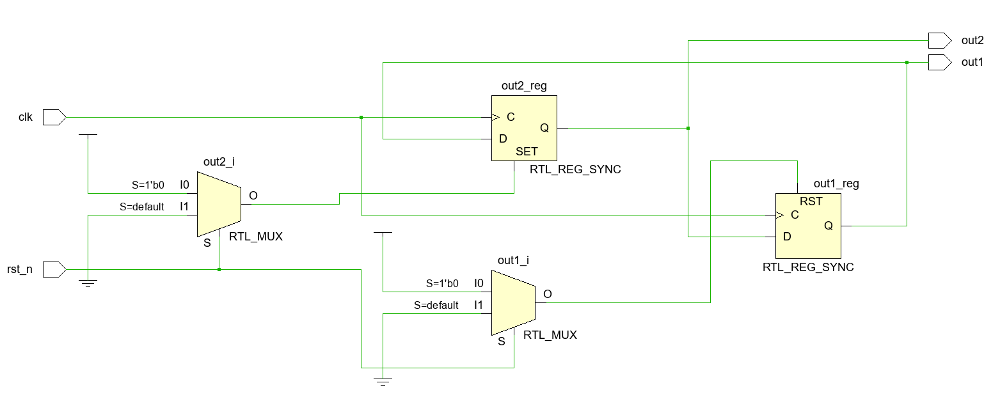

综合后的原理图：

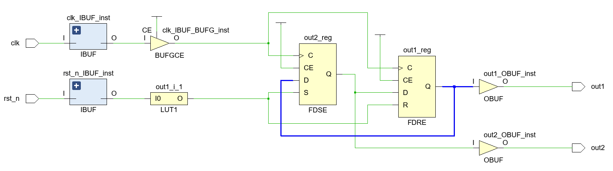


---

### 一、阻塞式赋值

阻塞是指一条语句在执行时不允许被其他语句打断。

阻塞式赋值先计算 RHS 的值再进行赋值，且不允许其他语句打断，直到当前赋值语句完成。即 RHS 赋给 LHS 之后，才允许别的赋值语句执行。

可综合的阻塞赋值操作在 RHS 不能设定延迟（零延迟也不允许）。可能是因为这样相当于让电路计时一段时间后才继续下一个操作（也是电路），实际上无法实现。

always 块中的阻塞式赋值的 LHS 也必须是 reg 型变量，但是实际上不会生成触发器。 


---

### 二、非阻塞式赋值

非阻塞指 always 块中所有的非阻塞赋值语句同时计算 RHS 并向 LHS 赋值，无先后之分。

#### 2.1、单条非阻塞赋值

源码：

```verilog
module unblocking(
        input a,
        input b,
        input c,
        output out1,
        output out2,
        input clk
    );

    reg out1_r;
    reg out2_r;

    always @(posedge clk) begin
        out1_r <= a & b;
    end

    always @(*) begin
        out2_r = b & c;
    end

    assign out1 = out1_r;
    assign out2 = out2_r;

endmodule
```

仿真代码：

```verilog
module unblocking_tb();

    // Ports
    reg a = 0;
    reg b = 0;
    reg c = 0;
    wire out1;
    wire out2;
    reg clk = 0;

    initial begin
        $monitor("[%0t]: a=%0b b=%0b c=%0b out1=%0b out2=%0b", $time, a, b, c, out1, out2);
    end

    unblocking
        unblocking_dut (
            .a (a ),
            .b (b ),
            .c (c ),
            .out1 (out1 ),
            .out2 (out2 ),
            .clk  ( clk)
        );

    initial begin
        begin
            a = 0;
            b = 0;
            c = 0;
            #30;
            a = 1;
            b = 1;
            c = 1;
            #50;
            a = 0;
            b = 0;
            c = 0;
            #50;
            $finish;
        end
    end

    always
        #5  clk = ! clk ;

endmodule
```

生成逻辑：

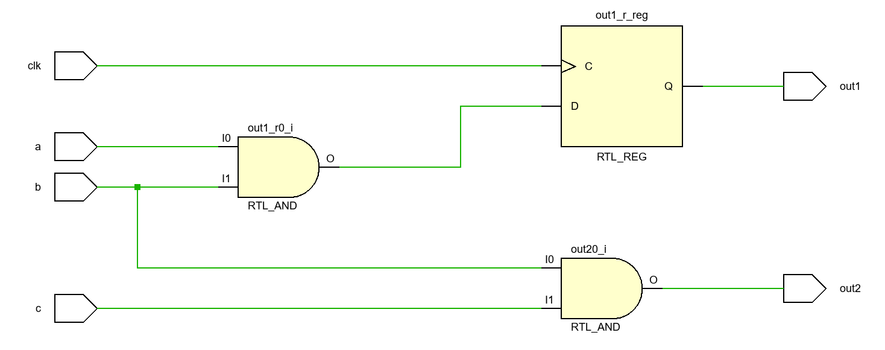

仿真波形：

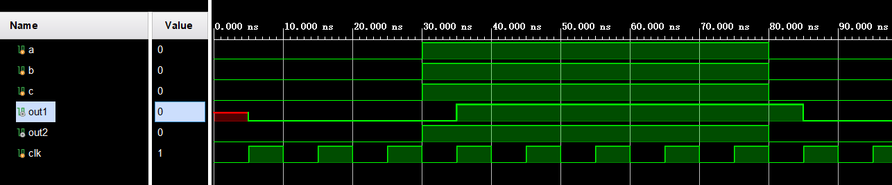

将 RHS 的计算和 LHS 的赋值看成两个独立的电路模块，从以上测试可以看出：

**1）阻塞赋值相当于 RHS 计算的输出和 LHS 赋值的输入直接通过导线连了起来**

**2）非阻塞赋值相当于 RHS 计算的输出和 LHS 赋值的输入通过一个 触发器进行了隔离，因此就有新值和旧值之分，不会出现阻塞赋值中出现的竞争问题。**

#### 2.2、某语句的 RHS 含块内其他语句的 LHS

源码（只贴关键部分）：

```verilog
    always @(posedge clk) begin
        a_r <= a;
        b_r <= b;
        out1_r <= a_r & b_r;
    end
```

生成逻辑：

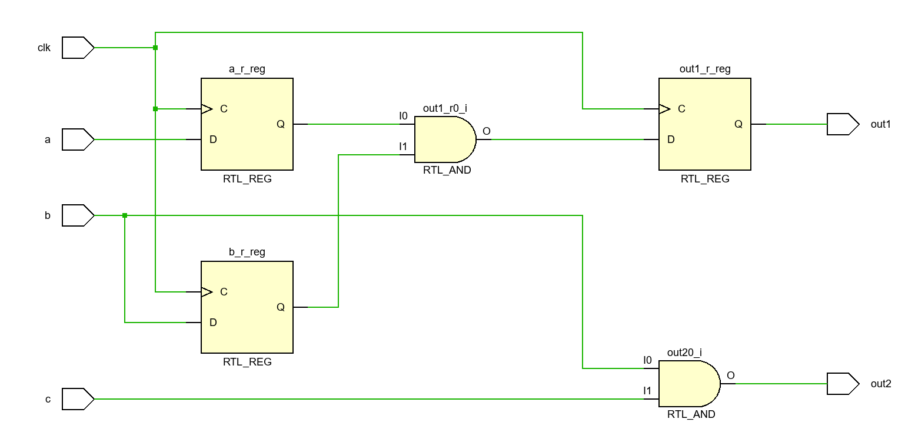

仿真波形：

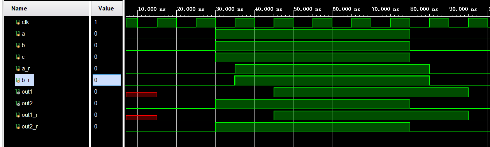

可以看出，在 a、b 拉高后的第一个时钟上升沿，a_r、b_r 拉高，第二个时钟上升沿，out1 和 out1_r 才拉高。说明，第一个时钟时，a_r、b_r 采样到的是 a、b 的最新值（由于 a、b 是 wire，不存在新旧值一说，只有新值），而 out_r 采样到的是 a_r、b_r 的旧值，直到第二个时钟才采样到新值。

调整仿真代码，使 a、b 变化的时刻与时钟上升沿对齐：

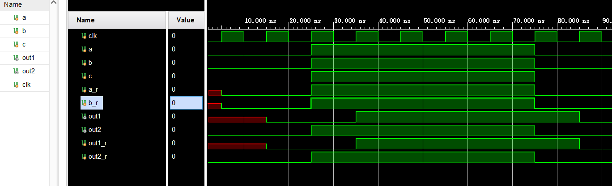

a_r、b_r 仍能在第一个周期拉高，而 out1_r 比 a_r、b_r 延后一个时钟。

以上说明，对于 always 块中的非阻塞赋值会在何时起作用，要看其 RHS 的类型。

2.1 中 RHS 都是 wire 型（a 和 b） ，则在变化后的第一个周期就会立即产生变化。因为只有一级触发器，当上升沿来临时，会立即采样 D 端数据更新到 Q 端。

而 2.2 中 RHS 存在 reg 型（a_r 和 b_r） ，则会延迟一个周期产生变化。因为第一个上升沿时，a_r 和 b_r 采样到新值，D 端更新到 Q 端，然后进行与运算。与此同时 out1_r 采样到上升沿时刻 a_r 和 b_r 所在触发器 Q 端的数据进行与运算的结果，此时该数据为旧值，即该周期中不能接触到 RHS 中 reg 型变量（a_r 和 b_r）的新值。第二个上升沿时，RHS 中 out1_r 所在触发器的 D 端已经是新值，此时立即更新到 Q 端，实现新值的赋值。

本质上，会不会产生延迟，取决于路径中产生了几级触发器。如果某个变量所在的数据路径中只有一级触发器，则无论数据早于时钟上升沿变化，还是数据与时钟上升沿同步变化，都不会产生延迟，数据会立即更新（只是后者的 RHS 中的计算不能太复杂，否则可能建立/保持时间不满足）。而如果某变量所在的数据路径中有两级触发器，则会产生一个周期的延迟，因为触发器每一拍只能传递一级。

#### 2.3、连续级联赋值

在一个 always 块内，多次级联寄存器，观察现象。预期结果是 n 次级联赋值产生 n 级触发器，最终输出结果产生 n-1 个时钟的延迟。

源码：

```verilog
always @(posedge clk) begin
    a_r <= a;
    b_r <= a_r;
    c_r <= b_r;
    out1_r <= a_r & b_r & c_r;
end
```

生成逻辑：

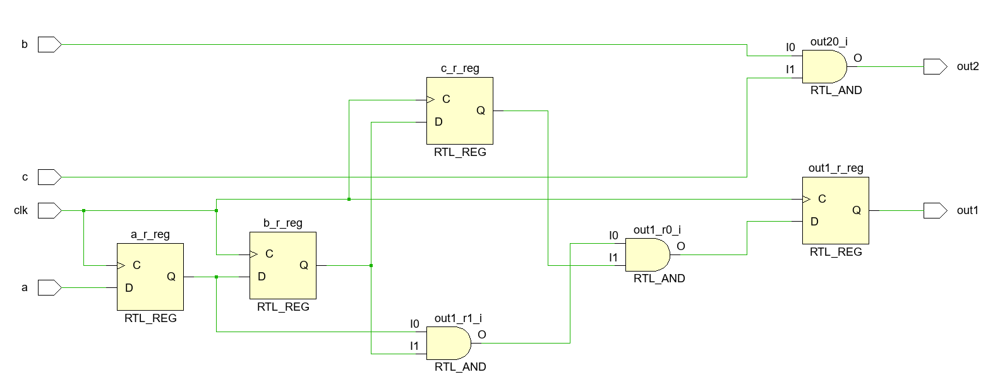

仿真波形：

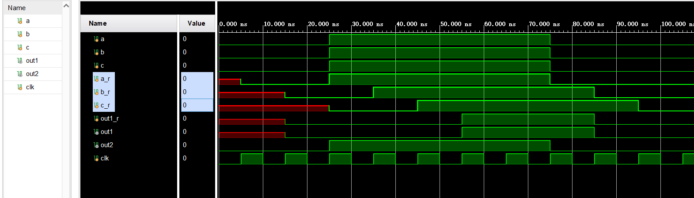

由于 out1 所在的链路中，存在 4 级触发器，因此 out1 的输出相比 a、b、c 的输入延迟了 3 个周期。


---

### 三、if-else 语句中赋值

这里测试一下 if-else 语句会不会对赋值语句的执行时间产生影响。

#### 3.1、简单 if-else（条件为外部输入 wire）

源码：

```verilog
module unblocking_ifelse(
    input a,
    input b,
    input c,
    output out1,
    output out2,
    input clk
);

reg out1_r;
reg out2_r;

// 非阻塞
always @(posedge clk) begin
    if(c)
        out1_r <= a | b;
    else begin
        out1_r <= 1'b0;
    end
end
// 阻塞
always @(*) begin
    if(c)
        out2_r = a | b;
    else begin
        out2_r = 1'b0;
    end
end

assign out1 = out1_r;
assign out2 = out2_r;

endmodule
```

生成逻辑：

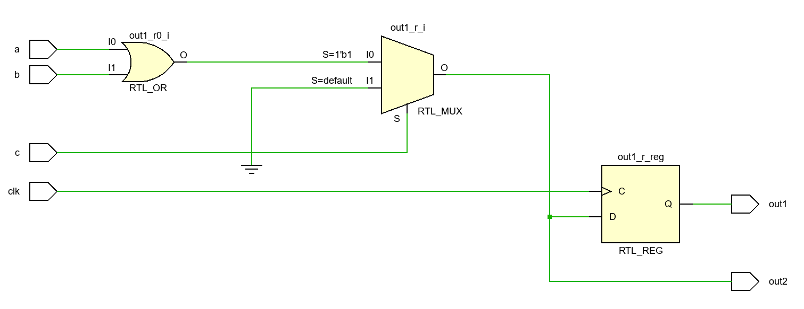

从原理图中可以看出，使用了 if-else 语句之后，会生成 MUX 逻辑，判断条件 c 被作为 2 to 1 MUX 的选通端信号。MUX 的输出端链接 out1 的触发器，并直连 out2。

因此，当 c 为 1 时，MUX 的 I0 输入选通到输出，组合逻辑输出 out2 会立刻进行赋值输出，时序逻辑输出 out1 会在时钟上升沿进行赋值并输出。由于这里只生成了一级触发器，所以输出不会延时一拍。在仿真代码中设置 c 的变化与 clk 上升沿同步时，就会看到 out1 与 out2 同时变化的现象。

仿真波形：

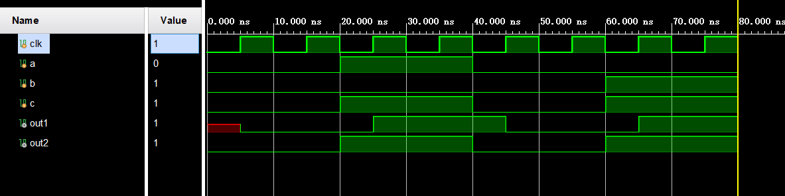

out1（时序逻辑） 的数据在下一个时钟上升沿发生改变，out2（组合逻辑） 的数据在 a、b、c 变化的当时就改变。

如果将测试逻辑中的第一个延时从 20 修改成 25（a、b、c 的变化与时钟上升沿对齐）：

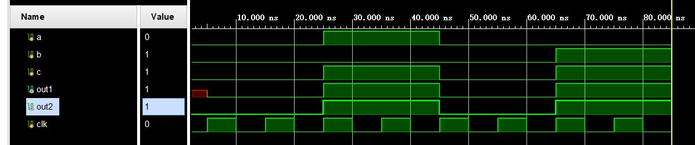

则组合逻辑与时序逻辑的变化是相同的。说明简单的 if-else 语句不会造成输出延迟。这个例子中，if 的条件是简单的外部输入，下面试一试 if 条件中或条件表达式中含其他 reg 输出。

#### 3.2、if 条件中含 reg 变量

将 if 的条件由外部输入的 wire 变量，换成一个 reg 变量，并在另一个 always 块中对这个 reg 变量做非阻塞赋值。

源码：

```verilog
always @(posedge clk) begin
    c_r <= c;
end

always @(posedge clk) begin
    if(c_r)
        out1_r <= a | b;
    else begin
        out1_r <= 1'b0;
    end
end
```

生成逻辑：

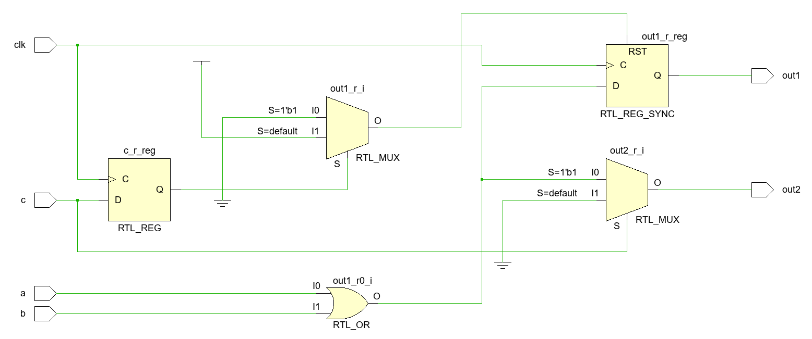

由于寄存器变量在 if 条件中，所以在 c 输入和 MUX 控制端之间多了一级触发器。

波形图：

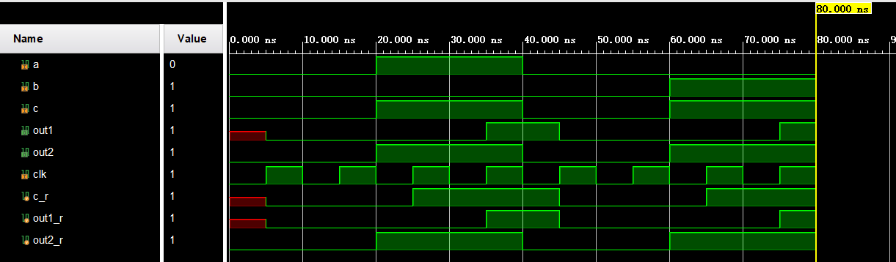

可以看出，由于 c_r 生成了触发器，out1 比 a、b、c 延迟了一个周期

另外，本例中如果将 c_r <= c 与条件语句放在同一个 always 块中，也是一样的效果。

```verilog
always @(posedge clk) begin
    c_r <= c;
    if(c_r)
        out1_r <= a | b;
    else begin
        out1_r <= 1'b0;
    end
end
```

#### 3.3、条件表达式中含 reg 变量


源码：

```verilog
always @(posedge clk) begin
    if(c) begin
        a_r <= a;
        b_r <= b;
    end
    else begin
        a_r <= 1'b0;
        b_r <= 1'b0;        
    end
    out1_r <= a_r | b_r;
end
```

生成逻辑：

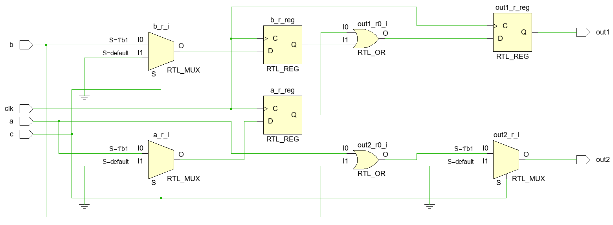

由于 if 条件中是 wire 变量，而条件表达式中是 reg 变量，所以触发器生成在了 MUX 和 或门之间。

波形图：

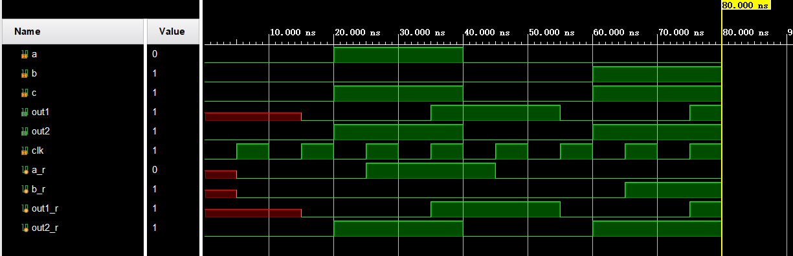

由于触发器的存在，out1 相对于 a、b、c 有一拍的时延。


---

### 四、总结

阻塞式赋值没有时延周期一说。

非阻塞式赋值如果是最简单的形式，也不会有时延周期一说，在上升沿之后很快就会输出结果。

如果非阻塞式赋值语句中存在 reg 变量，由于 reg 变量会生成触发器，则数据通路中触发器级数减 1 就是该路径的时延周期数。

赋值语句使用时的八条建议：

1）建模时序逻辑时，用非阻塞赋值
2）建模锁存器时，用非阻塞赋值
3）用 always 块建模组合逻辑时，用阻塞赋值
4）在同一个 always 块中同时建模时序逻辑和组合逻辑时，使用非阻塞语句。
5）不要再同一个 always 块中混合使用阻塞语句和非阻塞语句。
6）不要在多个 always 块中对同一个变量赋值。
7）使用 $strobe 来显示已经用非阻塞赋值语句赋值过的值。
8）不要在赋值时使用 #0 延时。


