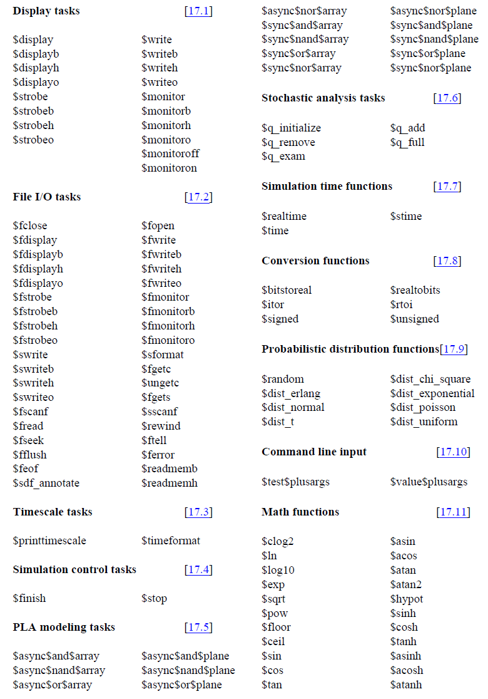
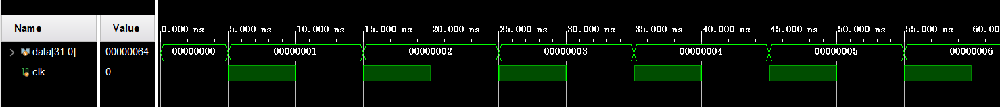
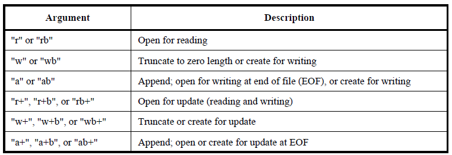
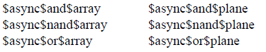
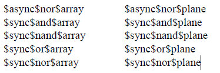
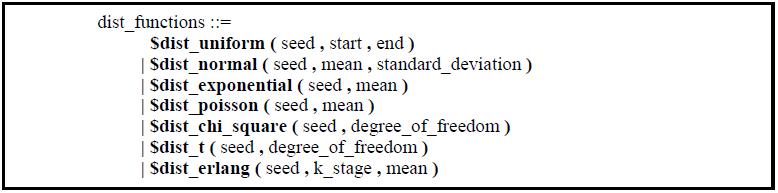
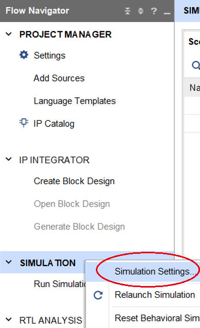
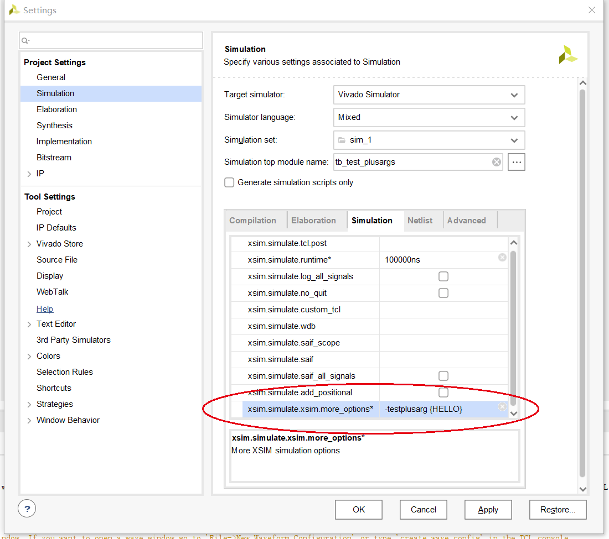

系统任务在 Verilog HDL 语言中属于行为级建模，系统任务的调用要出现在 initial 与 always 结构中，一般在仿真代码中使用。所有的任务都以 $ 开头。

<!--more-->

测试环境：Vivado2021.1 自带仿真器 XSIM。

---

### 〇、总述

根据 Verilog HDL 标准，共有十类系统任务（函数）：



这里挑选常用的几类进行总结。


---

### 一、显示任务（Display tasks）

系统任务显示组分为三类：显示和写入任务、选通（strobed）监控任务和连续监控任务。  

#### 1.1、$display 和 \$write

$display 和 $write 都是用来显示和输出信息，格式为：

```verilog
$display(p1,p2,....pn);
$write(p1,p2,....pn);
```

p1 称为“格式控制”，p2,...pn 称为“输出表列”。参数 p2,...pn 按 p1 中给定的格式输出。

两者的区别在于：

- $display 输出后自动换行
- $write 不换行，可以在一行中多次调用

格式控制的内容包括在双引号中，由**输出格式**指定输出表列中的变量输出的形式，部分字符需要**转义**表示。具体见如下表格。

| 输出格式 | 描述                                                         |
| -------- | ------------------------------------------------------------ |
| %h or %H | 十六进制。                                                   |
| %d or %D | 十进制。                                                     |
| %o or %O | 八进制。                                                     |
| %b or %B | 二进制。                                                     |
| %c or %C | ASCII 码字符。                                               |
| %l or %L | Display library binding information.                         |
| %v or %V | 输出标量网络型数据的信号强度，例如Supply dirve、Pull drive 等。 |
| %m or %M | 输出等级层次的名字，不接受参数。                             |
| %s or %S | 字符串。                                                     |
| %t or %T | 以当前时间格式输出。                                         |
| %u or %U | Unformatted 2 value data.                                    |
| %z or %Z | Unformatted 4 value data.                                    |
| %e or %E | 指数形式输出实数。                                           |
| %f or %F | 十进制形式输出实数。                                         |
| %g or %G | 以指数或十进制形式输出实数，无论各种格式都以较短的结果输出   |

其中 %l、%u、%z 是在 Verilog IEEE 标准中列出的。

| 转义字符 | 描述                                         |
| -------- | -------------------------------------------- |
| \n       | 换行                                         |
| \t       | 制表符                                       |
| \\\      | 反斜杠                                       |
| \\"      | 双引号                                       |
| \ddd     | 1-3位八进制数表示的 ASCII 字符 (0 ≤ d ≤ 7)。 |
| %%       | 百分号                                       |


举例：

```verilog
module tb_display();

reg [31: 0] in1;
reg [31: 0] in2;
reg [31: 0] out;
wire wire_sgn;

assign wire_sgn = out;

initial begin
    in1 = 32'd33;
    in2 = 32'd34;
    out = 32'd35;
    
    $display("in1 = %b, in2 = %b and out = %b", in1, in2, out);
    $display("in1 = %o, in2 = %o and out = %o", in1, in2, out);
    $display("in1 = %d, in2 = %d and out = %d", in1, in2, out);
    $display("in1 = %h, in2 = %h and out = %h", in1, in2, out);
    $display("in1 = %c, in2 = %c and out = %c", in1, in2, out);
    $display("in1 = %e, in2 = %e and out = %e", in1, in2, out);
    $display("in1 = %f, in2 = %f and out = %f", in1, in2, out);
    $display("in1 = %g, in2 = %g and out = %g", in1, in2, out);
    $display("%m");
    $display("wire signal strength = %m", wire_sgn);

    $display("\n \t \\ \" \043 %%");

    $finish;
end

endmodule
```

输出结果为：

```verilog
in1 = 00000000000000000000000000100001, in2 = 00000000000000000000000000100010 and out = 00000000000000000000000000100011
in1 = 00000000041, in2 = 00000000042 and out = 00000000043
in1 =         33, in2 =         34 and out =         35
in1 = 00000021, in2 = 00000022 and out = 00000023
in1 = !, in2 = " and out = #
in1 = 3.300000e+01, in2 = 3.400000e+01 and out = 3.500000e+01
in1 = 33.000000, in2 = 34.000000 and out = 35.000000
in1 = 33, in2 = 34 and out = 35
tb_sys_task
wire signal strength = tb_sys_taskx

 	 \ " # %
```


对于显示数字前有占位空格或补 0 问题，可以在输出格式符的字母前加 0 来解决：

```verilog
$display("in1 = %0b, in2 = %0b and out = %b", in1, in2, out);
$display("in1 = %0o, in2 = %0o and out = %o", in1, in2, out);
$display("in1 = %0d, in2 = %0d and out = %d", in1, in2, out);
$display("in1 = %0h, in2 = %0h and out = %h", in1, in2, out);
```

输出为：

```verilog
in1 = 100001, in2 = 100010 and out = 00000000000000000000000000100011
in1 = 41, in2 = 42 and out = 00000000043
in1 = 33, in2 = 34 and out =         35
in1 = 21, in2 = 22 and out = 00000023
```

还有一种输出方式：

```verilog
$display($time, , "display1 data = ", data);
```


另外也可以用 $display 和 $write 来打印当前时间：

```verilog
  $display("cur time = %t", $time);
  $write("cur time = %t", $time);
```

输出为：

```verilog
cur time =                    0
cur time =                    0
```


#### 1.2、$strobe

$strobe 命令提供了在选定时间显示模拟数据的能力。该时间是当前仿真时间的末尾，仿真时间马上要完成的时候，此时该仿真时间内的所有仿真事件都已完成。

使用方法与 $display 一样，区别在于：

- $strobe 在当前仿真时间结束时完成

- $display 立即执行。

$strobe 与 $monitor 的区别在于：

- $strobe 在调用后只输出一次。
- $monitor 在调用后，只要参数列表发生变化，就会自动输出。


测试：

```verilog
module tb_strobe();

reg [31: 0] data;
reg clk;

initial begin
    clk = 0;
    data = 0;
    forever #5 clk = ~clk;
end

always @(posedge clk) begin
    if(data != 32'h100)
        data = data + 1;
    else
        data = 0;
end

initial begin
    forever @(negedge clk)
        $strobe ("At time %0d, data is %h", $time, data);
end

endmodule
```

波形：



日志输出为：

```verilog
At time 10, data is 00000001
At time 20, data is 00000002
At time 30, data is 00000003
At time 40, data is 00000004
At time 50, data is 00000005
At time 60, data is 00000006
...
```


#### 1.3、$monitor

$monitor 任务提供了监视和显示参数列表中指定的变量或表达式的值的能力。

当调用了带有一个或多个参数的 $monitor 任务时，仿真器会建立一种机制，使得每当参数列表中的变量或表达式的值（除了 $time、$stime 和 $realtime 这些系统功能外）改变时，整个参数列表都会在时间步的末尾输出，就像调用了 $display 一样。如果两个或多个参数同时改变值，则只会产生一个显示新值的显示。  

在任何时候，只有一个 $monitor 显示列表可以激活；但是，在仿真过程中，可以多次发出带有新显示列表的新 $monitor 任务。 需要在程序中及时控制 monitor 的开启和关闭，使得不同的模块都可以调用 monitor，同时调用两个 monitor 会自动关闭前一个（后面的测试证实不是这样）。

$monitoron 和 $monitoroff 任务通过控制监控标志来启用和禁用 monitor 任务。使用 $monitoroff 可以关闭监控标志并禁用 monitor。$monitoron 任务可用来打开监控标志，以启用 monitor，并且最近调用的 $monitor 可以恢复它的显示。

$monitoron 调用后会立即执行一次输出，无论参数列表中的值是否发生变化；这可以用来在监控任务开始时设置初值。监控标志默认在仿真开始时打开。

用法：

```verilog
  $monitor($time, , "monitor1 data = ", data);
  $monitor("monitor2 @ %d, data = %d", $time,  data);
```


##### 1.3.1、测试一

```verilog
module tb_monitor();

    reg [31: 0] data1;
    reg [31: 0] data2;
    reg clk;
    
    initial begin
        clk = 0;
        data1 = 0;
        data2 = 0;
        forever #5 clk = ~clk;
    end
    
    initial begin
        #10;    // time 10
        $monitor("At time %0d, data1=%0d, data2=%0d", $time, data1, data2);
        
        #20;    // time 30
        data1 = 10;
        
        #30;	// time 60
        data2 = 20;
        
        #10;	// time 70
        data1 = 30;
        $monitoroff;
        
        #10;	// time 80
        data1 = 40;
        
        #10;	// time 90
        data2 = 50;
        $monitoron;
        
        #10;	// time 100
        data1 = 60;      
        
        #10;	// time 110
        $monitoroff;    
        
        #10;	// time 120
        data2 = 70;
        $monitor("new task: At time %0d, data1=%0d, data2=%0d", $time, data1, data2);    
        
        #10;	// time 130
        data1 = 80;        
        
        #10;	// time 140
        data2 = 90;
        $monitoron;     
        
        #10;	// time 150
        data1 = 100;
        
        #10;	// time 160
        data2 = 110;
        
        #10;	// time 170
        data1 = 120;

        $finish;
    end
endmodule
```

输出为：

```verilog
At time 10, data1=0, data2=0
At time 30, data1=10, data2=0
At time 60, data1=10, data2=20
At time 90, data1=40, data2=50
At time 100, data1=60, data2=50
new task: At time 140, data1=80, data2=90
At time 140, data1=80, data2=90
At time 150, data1=100, data2=90
new task: At time 150, data1=100, data2=90
At time 160, data1=100, data2=110
new task: At time 160, data1=100, data2=110
```

可以看出：

1） $monitor() 调用的时刻，monitor 会输出（如 time 10 时刻）。

2）参数列表中任一参数变量发生变化，monitor 都会输出（如 time 30、60 时刻）。

3）$monitoroff 所在时刻，monitor 不输出（如 time 70）。

4）$monitoron 所在时刻，monitor 会输出（如 time 90）。

5）$monitoroff 执行后，再执行 $monitor()，monitor 不会输出（如 time 120、130）。与前文所述存在监控标志用以使能 monitor，且监控标志初始时是开启的相符。

6）$monitoroff 之后，增加新的 monitor()，然后执行 $monitoron 重新打开后，两个 $monitor() 语句的内容都会输出（如 time 140、150、160），与前文所述不符。

7）$finish 所在的时刻，即便信号值发生变化，也不会被 monitor 输出（如 time 170）。


##### 1.3.2、测试二

上述第 6 条与前文所述“在任何时候，只有一个 $monitor 显示列表可以激活”相矛盾。

修改代码，在一个 initial 语句块中一次性调用三个 $monitor() 任务。

```verilog
initial begin
    #10;
    $monitor("monitor 01: At time %0d, data1=%0d, data2=%0d", $time, data1, data2);
    $monitor("monitor 02: At time %0d, data1=%0d, data2=%0d", $time, data1, data2);
    $monitor("monitor 03: At time %0d, data1=%0d, data2=%0d", $time, data1, data2);

    #20;
    data1 = 10;

    #30;
    data2 = 20;

    #10;
    data1 = 30;
    $monitoroff;

    $finish;
end
```

输出为：

```verilog
monitor 01: At time 10, data1=0, data2=0
monitor 02: At time 10, data1=0, data2=0
monitor 03: At time 10, data1=0, data2=0
monitor 01: At time 30, data1=10, data2=0
monitor 02: At time 30, data1=10, data2=0
monitor 03: At time 30, data1=10, data2=0
monitor 01: At time 60, data1=10, data2=20
monitor 02: At time 60, data1=10, data2=20
monitor 03: At time 60, data1=10, data2=20
```

说明同一个语句块（此例中的 initial 块）中的多个 $monitor() 是可以同时激活的。

测试不同语句块中的多个 $monitor() 能否同时激活：

```verilog
initial begin
    #10;
    $monitor("monitor 01: At time %0d, data1=%0d", $time, data1);

    #20;
    data1 = 10;

    #30;
    data1 = 20;

    #10;
    data1 = 30;
end

initial begin
    #10;
    $monitor("monitor 02: At time %0d, data2=%0d", $time, data2);

    #20;
    data2 = 10;

    #30;
    data2 = 20;

    #10;
    data2 = 30;

    #30;
    $finish;
end
```

输出为：

```verilog
monitor 01: At time 10, data1=0
monitor 02: At time 10, data2=0
monitor 01: At time 30, data1=10
monitor 02: At time 30, data2=10
monitor 01: At time 60, data1=20
monitor 02: At time 60, data2=20
monitor 01: At time 70, data1=30
monitor 02: At time 70, data2=30
```

两个 initial 块中的 monitor 都能输出，说明同一 module 的不同语句块中可以同时存在多个 monitor。


##### 1.3.3、测试三

再测试下多个 module 中的 monitor 能否同时使用：

1）顶层模块

```verilog
module tb_monitor_topmodule();

reg clk;
reg [31:0] data;

initial begin
    clk = 0;
    forever #5
        clk = ~clk;
end

tb_monitor_submodule1 sub1(
    .clk(clk),
    .data(data)
);

tb_monitor_submodule2 sub2(
    .clk(clk),
    .data(data)
);

initial begin
    #10;
    data = 10;
    #10;
    data = 20;
    #10;
    data = 30;
    #10;
    data = 40;
    #10;
    data = 50;
    #10;
    data = 60;
    #10;
    data = 70;
end

endmodule
```

2）子模块1

```verilog
module tb_monitor_submodule1(
    input wire clk,
    input wire [31: 0] data
);

initial begin
    $monitor("sub1 @ %t: data = %0d", $time, data);
end

endmodule
```

3）子模块2

```verilog
module tb_monitor_submodule2(
    input wire clk,
    input wire [31: 0] data
);

initial begin
    $monitor("sub2 @ %t: data = %0d", $time, data);
end

endmodule
```

输出为：

```verilog
sub1 @                    0: data = x
sub2 @                    0: data = x
sub2 @                10000: data = 10
sub1 @                10000: data = 10
sub2 @                20000: data = 20
sub1 @                20000: data = 20
sub2 @                30000: data = 30
sub1 @                30000: data = 30
sub2 @                40000: data = 40
sub1 @                40000: data = 40
sub2 @                50000: data = 50
sub1 @                50000: data = 50
sub2 @                60000: data = 60
sub1 @                60000: data = 60
sub2 @                70000: data = 70
sub1 @                70000: data = 70
```

可以看出，两个子模块在 $monitor() 中设置的参数变量发生改变时，相应的 monitor 都做了输出。

综合以上三个测试结果，可以得出不存在只能有一个 monitor 工作的问题。同时开启多个 monitor 时，都能同时工作，无论是在同一语句块内、不同语句块内还是不同 module 内。从很多博客中可以看到多个 monitor 不能同时工作的论述而且附有仿真代码和结果，这里的矛盾可能是因为本文使用的 Vivado2021.1 版本较新，对仿真器的功能进行了升级，不过并不确定是否如此。


---

### 二、文件  I/O  任务（File I/O tasks）

基于文件的操作的系统任务和功能可分为以下类别:  

- 打开和关闭文件的函数和任务
- 输出值到文件的任务
- 输出值到变量的任务
- 从文件读出值并载入变量或存储器的任务和函数


#### 2.1、$fopen、\$fclose、\$ferror 打开和关闭文件

| 函数                        | 描述                                                         |
| --------------------------- | ------------------------------------------------------------ |
| fd = $fopen("fname", mode); | 打开文件。fname 是文件名，mode 是打开格式，返回零值表示打开出错。fd 是 32bit 的 mcd（multichannel descriptor） |
| $fclose(fd);                | 关闭文件。                                                   |
| errno = $ferror(fd, str);   | 读取错误状态。errno 和 str 为零值说明读取无误。errno 非零表示出错，最近一次文件 I/O 操作所遇到的错误类型的字符串描述被写入 str 中，str 应该至少是640位宽。 |

mode 类型：




#### 2.2、$fdisplay、\$fwrite、\$fstrobe、\$fmonitor 文件写入

共 4 类，末尾带 b/h/o 只是以不同的进制输出。

| 函数                      | 描述                                     |
| ------------------------- | ---------------------------------------- |
| $fdisplay(fd, arguments); | 类似 \$display，自动换行                 |
| $fwrite(fd, arguments);   | 类似 \$write，不换行                     |
| $fstrobe(fd, arguments);  | 类似 \$stobe，调用后写入一次             |
| $fmonitor(fd, arguments); | 类似 \$monitor，监测到数据有变化就写文件 |


测试：

```verilog
module tb_file_options();

    integer fd;
    integer err;
    reg [639: 0] str;

    initial begin
        fd = $fopen("./file_io_test.txt", "a+");
        err = $ferror(fd, str);
        if (!err) begin
            $fdisplay(fd, "fd: %h", fd) ;
            $fdisplay(fd, "str: %h", str) ;
            $fdisplay(fd, "err: %h", err) ;
            $fwrite(fd, "fd: %h   ", fd) ;
            $fwrite(fd, "str: %h   ", str) ;
            $fwrite(fd, "err: %h   ", err) ;
        end
        $fclose(fd);
    end

endmodule
```

可以看到在 `{工程目录}/{工程名}.sim/sim_1/behav/xsim/` 目录下生成了代码中设置的 file_io_test.txt 文件，其内容为：

```verilog
fd: ffffb1e0
str: 0000000000000000000000000000000000000000000000000000000000000000000000000000000000000000000000000000000000000000000000000000000000000000000000004e6f204572726f72
err: 00000000
fd: ffffb1e0   str: 0000000000000000000000000000000000000000000000000000000000000000000000000000000000000000000000000000000000000000000000000000000000000000000000004e6f204572726f72   err: 00000000   
```

符合预期。

如果需要输出有符号数，可以使用 $singed() 进行转化，例如：

```verilog
 $fdisplay(fd, "%d\n", $signed(result_pooling2)); 
```

输出为：

```verilog
fd:      -20000
```


#### 2.3、$swrite 和 \$sformat 数据格式化为字符串 

$swrite 和 \$sformat 用于向字符串中写数据。

| 函数                                                         | 描述                                                         |
| ------------------------------------------------------------ | ------------------------------------------------------------ |
| $swrite(output_reg, list_of_arguments);                      | 与 $fwrite 类似，将参数列表 list_of_arguments 中的参数写入 output_reg 变量中 |
| len = $sformat(output_reg, format_string, list_of_arguments) | 用法与 $display 类似，但只有第二个参数 format_string 会被解释为格式字符串。 |


测试：

```verilog
module tb_string_options();

    reg [299: 0] str_swrite;
    reg [299: 0] str_sformat;
    reg [63: 0] str_temp;
    integer len = 111;

    initial begin
        str_temp = "testStr";

        $swrite(str_swrite, "%s's length is %d", str_temp, len);
        $display("%s", str_swrite);
        $swrite(str_swrite, "abc", , 123);
        $display("%s", str_swrite);

        $sformat(str_sformat, "test: %s", str_temp);
        $display("%s", str_sformat);
        $sformat(str_sformat, "abc %d", 123);
        $display("%s", str_sformat);
        $sformat(str_sformat, "abc");
        $display("%s", str_sformat);
        $sformat(str_sformat, "abc", , 123);
        $display("%s", str_sformat);
    end

endmodule

```

输出为：

```verilog
       testStr's length is         111
                       abc         123
                        test:  testStr
                       abc         123
                                   abc
ERROR: No Format provided for this argument
ERROR: No Format provided for this argument
                                   abc
```

可以看出，当 $sformat 只有两个参数，且第二个参数中不含格式控制符，只有字符串时，是可以正常输出的。但是，如果 $sformat 有多个参数，且第二个参数不含格式控制符时，从第三个参数开始将报错。


#### 2.4、$fread、\$fgets、\$fscanf 文件读出

| 函数                                    | 描述                                                         |
| --------------------------------------- | ------------------------------------------------------------ |
| code = $fread(store, fd, start, count); | $fread 用于以二进制格式将数据从文件读取到 reg 或 memory 中。store 是存放读取内容的变量，可以是 reg，也可以是 memory。fd 是文件指针。start 是文件的起始位置，count 是读取文件的长度。如果没有指定起始地址，则选取内存的最低地址。这两个参数对于store 是 reg 类型时无效。 |
| code = $fgets(str, fd);                 | 以行为单位，按字符连续读取，直到 str 填满或一行读完。返回值 code 是读取的行数，code 为零值表示读出错。 |
| code = $fscanf(fd, format, args);       | 根据格式 format 从 fd 中读取数据到 args 中，遇空白符停止。code 为零值表示读出错。 |


$fread 测试：

```verilog
module tb_fread();

    integer fd;
    integer err;
    integer code;
    reg [639: 0] str;
    reg[799: 0] mem [9: 0];

    initial begin
        #10;
        fd = $fopen("./test_readmem.hex", "r");
        err = $ferror(fd, str);
        if(!err) begin
            // code = $fread(mem, fd, 0, 5);
            code = $fread(mem, fd);
            $display("$fread read num: %0d", code);
            $display("$fread read: %s", mem[0]);
            $display("$fread read: %s", mem[1]);
            $display("$fread read: %s", mem[2]);
            $display("$fread read: %s", mem[3]);
            $display("$fread read: %s", mem[4]);

        end
        $fclose(fd);
    end

endmodule
```

输出为：

```verilog
$fread read num: 80
$fread read:                     // test $readmemh and $readmemb
aa5555aa1234
1357ace1
1234abcd cdef1234
a5a55a5a
$fread read:                                                                                                     
$fread read:                                                                                                     
$fread read:                                                                                                     
$fread read:          
```

如果 reg 宽度足够大，数组中的第一项就将接收所有的字符。否则，写满一项，再写下一项。


#### 2.5、$ftell、\$fseek、\$rewind 文件定位

用法：

```verilog
integer pos;
pos = $ftell(fd);
```

pos 为文件 fd 的当前字节相对于文件起始位置的偏移量。

```verilog
code = $fseek ( fd, offset, operation );
code = $rewind ( fd );
```

$fseek 的 operation 的用法：

- 0 sets position equal to offset bytes
- 1 sets position to current location plus offset
- 2 sets position to EOF plus offset

`$rewind` 相当于 `$fseek (fd,0,0);`


#### 2.6、$fflush 刷新输出

```verilog
$fflush(mcd);
$fflush(fd);
$fflush();
```

将任何缓冲输出写到 MCD 指定的文件中，写到 fd 指定的文件中，或者如果不带参数调用 $fflush，写到所有打开的文件中。  


#### 2.7、$feof 探测 EOF

用法：

```verilog
integer code;
code = $feof ( fd );
```

探测到 EOF 返回非零值，否则返回零值。


#### 2.8、$readmemb、\$readmemh 从文件载入 memory 数据

用法：

```verilog
$readmemb ("file_name", memory_name[ , start_addr[, finish_addr]]);
$readmemh ("file_name", memory_name[ , start_addr[, finish_addr]]);
```

4 s个参数分别是：文件名、数组/reg 变量、起始地址和终止地址。其中，起始地址和终止地址可以省略。

测试数据（test_readmem.hex）：

```verilog
// test $readmemh and $readmemb
aa5555aa
1357ace1
1234abcd cdef1234
a5a55a5a
```

测试代码：

```verilog
module tb_readmem();

reg [63: 0] mem_1[9: 0];
reg [31: 0] mem_2[9: 0];

initial begin
    #10;
    $readmemh("./test_readmem.hex", mem_1);
    $display("mem_1 read data: %h", mem_1[0]); // 此处不能直接用 mem_1 作为参数
    $display("mem_1 read data: %h", mem_1[1]);
    $display("mem_1 read data: %h", mem_1[2]);
    $display("mem_1 read data: %h", mem_1[3]);
    $display("mem_1 read data: %h", mem_1[4]);
    $display("mem_1 read data: %h", mem_1[5]);

    $readmemh("./test_readmem.hex", mem_2);
    $display("mem_2 read data: %h", mem_2[0]); // 此处不能直接用 mem_2 作为参数
    $display("mem_2 read data: %h", mem_2[1]);
    $display("mem_2 read data: %h", mem_2[2]);
    $display("mem_2 read data: %h", mem_2[3]);
    $display("mem_2 read data: %h", mem_2[4]);
    $display("mem_2 read data: %h", mem_2[5]);

end

endmodule
```

输出为：

```verilog
mem_1 read data: 00000000aa5555aa
mem_1 read data: 000000001357ace1
mem_1 read data: 000000001234abcd
mem_1 read data: 00000000cdef1234
mem_1 read data: 00000000a5a55a5a
mem_1 read data: xxxxxxxxxxxxxxxx
mem_2 read data: aa5555aa
mem_2 read data: 1357ace1
mem_2 read data: 1234abcd
mem_2 read data: cdef1234
mem_2 read data: a5a55a5a
mem_2 read data: xxxxxxxx
```

$readmemh 读取数据时遇到空白符就会停止，然后写入到一个 reg 中，如果开辟了一整个大位宽的 reg，例如 

```verilog
reg [299: 0] mem[0: 0];
```

则只有第一个数据会被写入 mem，后面的数据不会写入。

如果数据的长度大于 reg 寄存器的长度，则会截掉高位保留低位后写入 reg。

因此，需要提前判断数据宽度和个数，合理规划用来接收的 reg 数组。


---

### 三、时间度量任务（Timescale tasks）

$printtimescale

$timeformat


---

### 四、仿真控制任务（Simulation control tasks）

#### 4.1、$finish

$finish 系统任务是让仿真器退出，并将控制权交还给主机操作系统。如果向这个任务提供了一个表达式，则它的值（0、1 或 2）决定了在发出提示符之前打印的诊断消息。 如果没有提供参数，则默认值为1。  

| 参数值 | 诊断信息                                                     |
| ------ | ------------------------------------------------------------ |
| 0      | 不输出信息                                                   |
| 1      | 输出当前仿真时刻和位置                                       |
| 2      | 输出当前仿真时刻，位置，和仿真中使用的 memory 和 CPU 时间的统计 |


$finish(0)

```verilog
$finish called at time : 20 ns
```

$finish(1)

```verilog
$finish called at time : 20 ns : File "D:/verilog_test/system_task/system_task.srcs/sim_1/new/tb_time.v" Line 38
```

$finish(2)

```verilog
$finish called at time : 20 ns : File "D:/verilog_test/system_task/system_task.srcs/sim_1/new/tb_time.v" Line 38
Memory in use : 7764 KB (peak memory: 7764 KB)     CPU usage : 0 ms
```


#### 4.2、$stop

$stop 可以暂停仿真。与 finish 相同，stop 也可以用 0、1、2 三个参数来指定打印诊断信息的内容。


---

### 五、PLA 建模任务（PLA modeling tasks）





---

### 六、随机分析任务（Stochastic analysis tasks）

$q_initialize 

$q_add

$q_remove 

$q_full

$q_exam


---

### 七、仿真时间函数（Simulation time functions）

#### 7.1、$time

$time 系统函数返回一个 64 位的整数，按调用它的模块的时间单位缩放。  

时间单位是指文件中由 `timescale 定义的内容（timescale 时间单位/时间精度）。

测试：

```verilog
module tb_time();

reg [31: 0] data;

initial begin
    data = 0;
    $display($time, , "display1 data = ", data);
    $display("display2 @ %d, data = %d", $time,  data);
    $monitor($time, , "monitor1 data = ", data);
    $monitor("monitor2 @ %d, data = %d", $time,  data);

    #10;
    data = 10;

    #10;
    $finish;
end

endmodule
```

输出为：

```verilog
                   0 display1 data =          0
display2 @                    0, data =          0
                   0 monitor1 data =          0
monitor2 @                    0, data =          0
                  10 monitor1 data =         10
monitor2 @                   10, data =         10
```


#### 7.2、$realtime

用法与 $time 相同，只是返回实数值（\$time 是整数）。


#### 7.3、$stime

用法与 $time 相同，只是返回 32bit 整数值（\$time 是 64bit 整数）。


---

### 八、转换函数（Conversion functions）

$bitstoreal     \$realtobits
$itor 			  \$rtoi
$signed         \$unsigned


---

### 九、概率分布函数（probabilistic distribution functions）

包含一组随机数生成器，用于返回按标准概率函数分布的整数值。

#### 9.1、$random

$random 函数每次被调用都会返回一个新的32位随机数。 随机数是一个有符号整数; 它可以是正的也可以是负的。

产生 -59~59 之间的随机数：

```verilog
reg [23:0] rand;
rand = $random % 60;
```

产生 0~59 之间的随机数：

```verilog
reg [23:0] rand;
rand = {$random} % 60;
```

#### 9.2、$dist_functions

包含一系列概率分布函数：



从上到下分别是：

- 均匀分布
- 正态分布
- 指数分布
- 泊松分布
- t 分布
- erlang 分布

---

### 十、命令行输入（Command line input）

以命令行参数的形式为仿真器提供信息，参数以 “+” 开头（Vivado 使用的 XSIM 仿真器没有使用 “+”）。

#### 10.1、$test\$plusargs

$test\$plusarg() 用于在 plusargs 列表中搜索用户指定的 plusarg_string。 该字符串在系统函数的参数中指定为字符串或解释为字符串的非实数变量。 此字符串不包括命令行参数的前导加号。 在命令行中出现的 plusargs 将按照提供的顺序进行搜索。 如果所提供的 plusargs 的前缀匹配所提供的字符串中的所有字符，则函数返回一个非零整数。 如果命令行中没有 plusarg 与所提供的字符串匹配，函数将返回整数值零。

测试：

```verilog
`timescale 1ns / 1ps

module tb_test_plusargs();

initial begin
	if($test$plusargs("HELLO")) $display("Hello argument found.");
	if($test$plusargs("HE"))  $display("The HE subset string is detected.");
	if($test$plusargs("H"))   $display("Argument starting with H found.");
	if($test$plusargs("HELLO_HERE"))$display("Long argument.");
	if($test$plusargs("HI"))  $display("Simple greeting.");
	if($test$plusargs("LO"))  $display("Does not match.");
end
    
endmodule
```

在 Vivado 界面左侧的 Fow Navigator 中的 SIMULATION 处右键，选择 Simulation Settings，如下图：



在 Simulation 的参数设置中，有一栏名为 xsim.simulate.xsim.more_options*，在其后添加：

```verilog
-testplusarg {HELLO}
```

{} 中的内容即为设置的参数。



输出为：

```verilog
Hello argument found.
The HE subset string is detected.
Argument starting with H found.
```

可以看出，不仅匹配了 HELLO，HE 和 H 也匹配到了，这是因为 $test\$plusargs() 做参数匹配时，是用参数列表中的参数去匹配命令行输入的参数，因此 HELLO、HE、H 都能匹配到外界输入的 HELLO。

关于参数设置的格式不同于前述的 IEEE 标准提到的以 “+” 开头，是因仿真器而异的。

如果要输入两个参数，可以设置成：

```verilog
-testplusarg {HELLO} -testplusarg {LO}
```


#### 10.2、$value\$plusargs

$value\$plusargs() 用于匹配给定参数，匹配成功则传递给指定的变量。

使用格式为：

```verilog
$value$plusargs("plusarg_string=/+format_string", variable)
```

类似于 C 语言中的 scanf()，其中：

- plusarg_string 是用于匹配的参数名称
- format_string 是参数的格式，类似于 $display 中的用法
- variable 是接收参数的变量

参数格式有以下几种：

| 参数格式 | 描述                                   |
| -------- | -------------------------------------- |
| %d       | decimal conversion                     |
| %o       | octal conversion                       |
| %h       | hexadecimal conversion                 |
| %b       | binary conversion                      |
| %e       | real exponential conversion            |
| %f       | real decimal conversion                |
| %g       | real decimal or exponential conversion |
| %s       | string (no conversion)                 |

 

测试：

```verilog
`timescale 1ns / 1ps

module tb_value_plusargs();
reg [8*32: 1] testname;
real frequency;

initial begin
    if($value$plusargs("TESTNAME=%0s", testname)) 
        $display("TESTNAME = %0s", testname);
    if (!($value$plusargs("FREQ+%0F", frequency)))
        frequency = 8.33333; // 166 MHz
    $display("frequency = %f", frequency);
end

endmodule
```

设置参数：

```verilog
-testplusarg TESTNAME=bar -testplusarg FREQ+9.234
```

 输出为：

```verilog
TESTNAME = bar
frequency = 9.234000
```

使用 $value\$plusargs() 需要预估接收参数的变量的位数，否则会根据一定的规则转换，出现非预期的结果。


---

十一、数学函数（Math functions）

$clog2   \$asin
$ln 		\$acos
$log10   \$atan
$exp 	 \$atan2
$sqrt      \$hypot
$pow     \$sinh
$floor     \$cosh
$ceil      \$tanh
$sin       \$asinh
$cos      \$acosh
$tan      \$atanh


