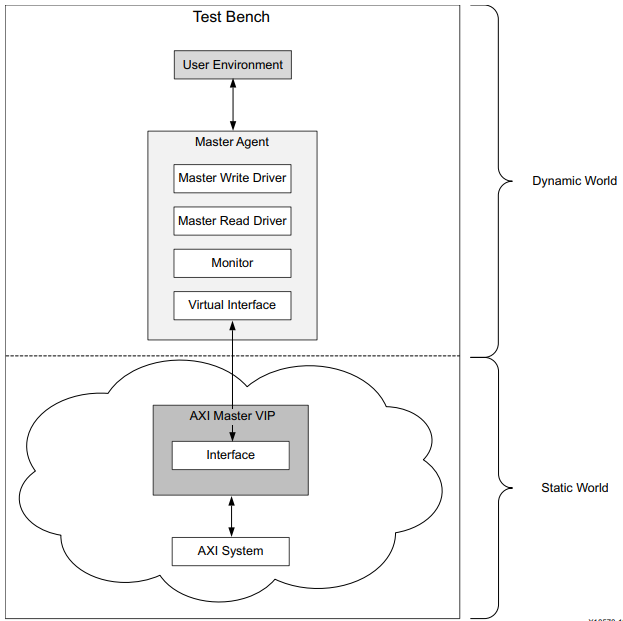
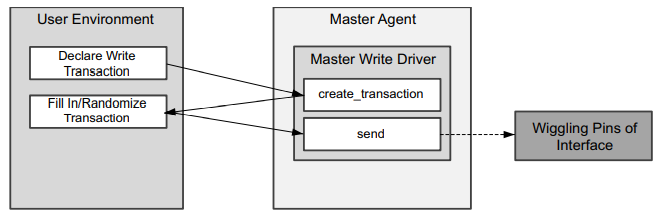

Xlinx AXI Verification IP 核（下简称 AXI VIP）用于仿真用户设计的基于 AXI 的 IP 核。AXI VIP 支持的 AXI 协议版本包括 AXI3、AXI4 和 AXI4-Lite。

<!--more-->

AXI VIP 是未加密的 SystemVerilog 源码，由一个 SystemVerilog 类库和可综合的 RTL 组成。

AXI VIP 综合为 wire，不会影响性能。

### 1、三种工作模式

AXI VIP 支持三种工作模式：

#### 1.1、AXI master VIP

生成 AXI 命令和写负载，并将其写入 AXI 系统。


#### 1.2、AXI slave VIP

响应 AXI 命令，并生成读负载和写响应。  


#### 1.3、AXI pass-through VIP

检查经过它的所有 AXI 传输，可被配置成三种模式：Monitor only、Master 和 Slave。


### 2、使用连接方式

#### 2.1、AXI Master VIP 拓扑


#### 2.2、AXI Slave VIP 拓扑


#### 2.3、AXI Pass-Through VIP 拓扑


### 3、IP 设置


### 4、Test Bench 拓扑






### 5、示例

#### 5.1、建立 BD 工程

本例中，使用一个 AXI VIP master 模块连接一个 AXI 接口的 BRAM。整体框图如下：


具体建立步骤：

##### 5.1.1、添加并配置 AXI Verification IP


选择接口类型，其他保持默认。

##### 5.1.2、添加并配置 AXI BRAM Controller


选择好接口类型和位宽，其他保持默认即可。

##### 5.1.3、运行自动连线

点击 Run Connection Automation，选中所有可选内容，然后点 OK。生成的原理图与前文中差不多即可，主要引出时钟和复位信号就行。

可以运行一下 Validate Design 来验证是否有明显问题。

##### 5.1.4、分配地址


正常情况下，Address Editor 中地址已经分配好，如果没有，可以手动解决。

##### 5.1.5、导出工程


分别在 bd 文件上右键运行 Generate Output Products 和 Create HDL Wrapper，前者选择 Out of context per IP。

其中，生成的 design_1_wrapper.v 就是仿真的待测模块（DUT）。


#### 5.2、创建仿真文件

对 AXI VIP IP 核进行仿真需要用 SystemVerilog 语言，因此在建立仿真文件时需要选择 SystemVerilog。


#### 5.3、导入需要的包

需要导入两个包：

```verilog
import axi_vip_pkg::*;
import <component_name>_pkg::*;
```

第一个 import 不需要更改。

第二个 import 需要查询具体工程的 <component_name> 信息。

获取 *<component_name>*的方法：

方法一：

运行 `get_ips *vip*`：

```verilog
get_ips *vip*
design_1_axi_vip_0_0
```

方法二：

从 Vivado UI 界面中查找：


故本设计中的 <component_name> 为 design_1_axi_vip_0_0。


#### 5.4、创建代理（agent）

1）首先根据 AXI VIP 的接口模式声明 agent，声明的形式为：


因为这里对 Master VIP 进行仿真，所以声明为：

```verilog
design_1_axi_vip_0_0_mst_t master_agent;
```

2）然后对 master_agent 进行实例化，实例化方法为：

```verilog
agent = new("my VIP agent", <hierarchy_path>.IF)
```

需要获得 IF 的 hierarchy path。建立含 AXI VIP 的 bd 工程，对一个空的 test bench 运行一次 Run Simulation 以获取 VIP 所在的层次路径。得到如下信息：

```verilog
# run 1000ns
Block Memory Generator module top_tb.dut.design_1_i.axi_bram_ctrl_0_bram.inst.\native_mem_mapped_module.blk_mem_gen_v8_4_4_inst  is using a behavioral model for simulation which will not precisely model memory collision behavior.
XilinxAXIVIP: Found at Path: top_tb.dut.design_1_i.axi_vip_0.inst
```

因此 agent 实例化为：

```verilog
master_agent = new("Master_AXI_VIP", top_tb.dut.design_1_i.axi_vip_0.inst);
```

然后启动 agent：

```verilog
master_agent.start_master();
```

实例化和启动的代码都要放在语句块中。

#### 5.5、创建 write transaction


