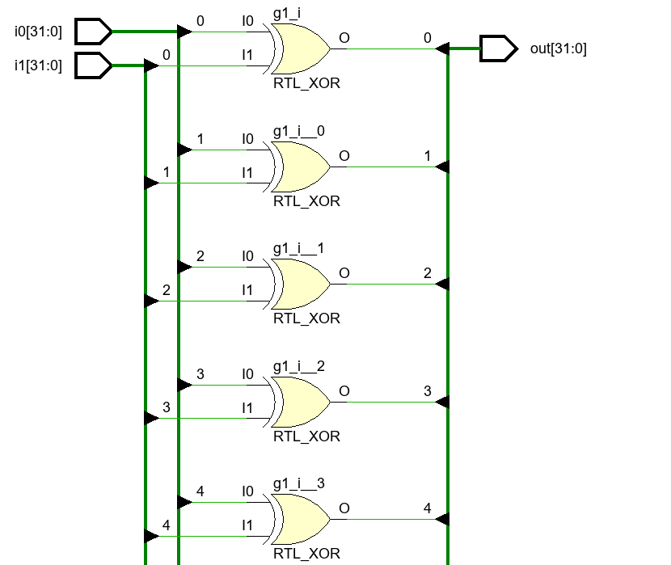

生成语句 generate 用于动态生成 Verilog 代码，便于生成参数化模块。生成语句能控制变量的声明、任务或函数的调用，还能对实例引用进行全面的控制。

<!--more-->

在以下场合使用生成语句可大大简化程序的编写过程：

- 对矢量的多个位进行重复操作
- 进行多个模块的实例引用的重复操作
- 根据参数的定义来确定程序中是否应该包括某段 Verilog 代码

Verilog 中有三种创建生成语句的方法：

- 循环生成
- 条件生成
- case 生成


---

### 一、循环生成语句 generate-for

循环生成语句允许对以下模块或模块项进行多次实例引用：

- 变量声明
- 模块
- 用户定义原语、门级原语
- 连续赋值语句
- initial 和 always 块


对于 generate-for 语句：

（1) 必须有genvar关键字定义for语句的变量。

（2）for语句的内容必须加begin和end（即使就一句）。

（3）for语句必须有个名字。


示例：

```verilog
module generate_for # (
        parameter N = 32
    )
    (
        output [N-1: 0] out,
        input  [N-1: 0]  i0,
        input  [N-1: 0]  i1
    );

    genvar j;

    generate
        for(j=0; j<N; j=j+1) begin : xor_loop
            xor g1(out[j], i0[j], i1[j]);
        end
    endgenerate

endmodule
```

生成的模型为：



展开后共 32 个 异或门。


### 二、条件生成语句 generate-if

条件生成语句类似于 if-else 结构，可以在设计模块中有条件地调用（实例引用）以下结构：

- 模块
- 用户定义原语、门级原语
- 连续赋值语句
- initial 或 always 块

if 的条件必须是常量表达式。根据条件，最多执行一个代码块，因为有可能一个都不执行。

用法：

```verilog
generate
    if(常量表达式)
        代码块;
    else
        代码块;
endgenerate
```


### 三、case 生成语句 generate-case

case 生成语句可以在模块中根据条件调用多个结构中的一个，可以调用（实例引用）以下结构：

- 模块
- 用户定义原语、门级原语
- 连续赋值语句
- initial 或 always 块


用法：

```verilog
generate
    case(N)
        1: 代码块;
        2: 代码块;
        ...
        default: 代码块;
    endcase
endgenerate
```


