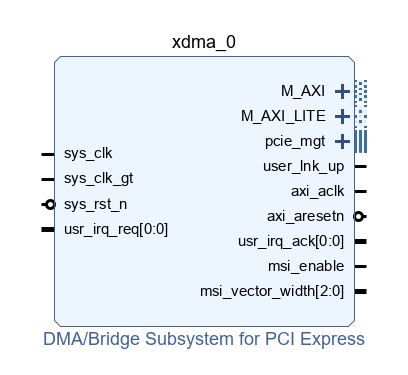
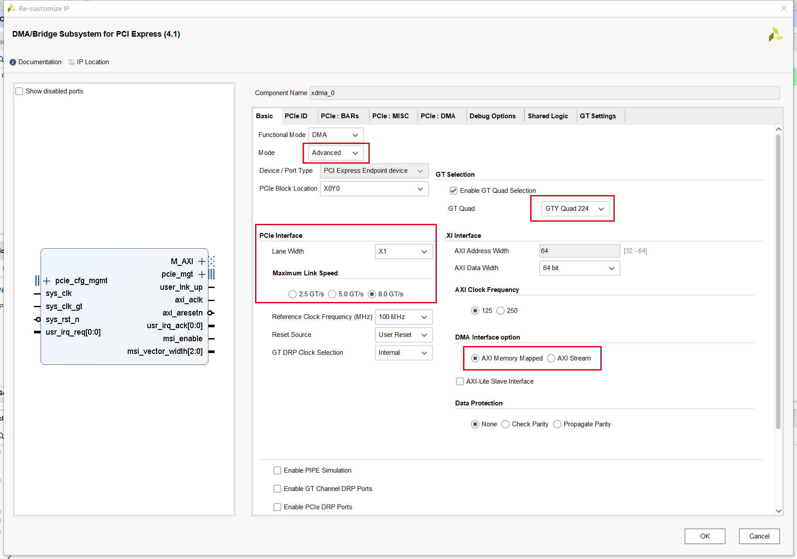
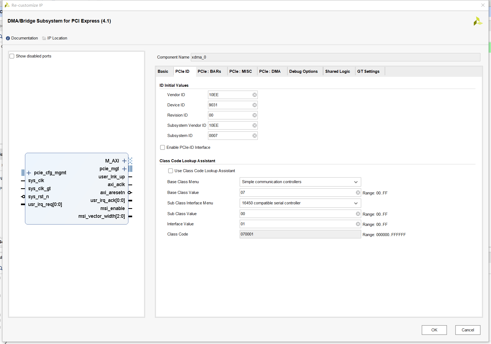
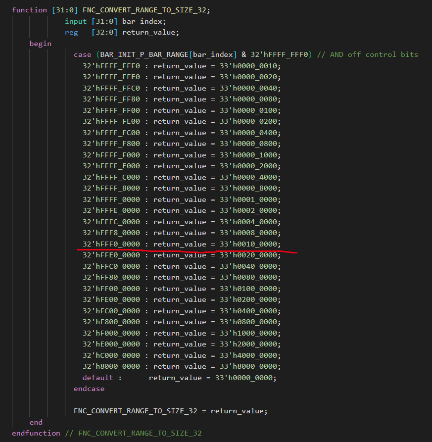
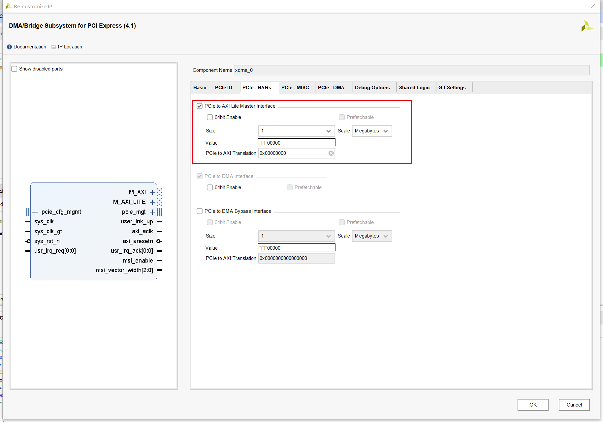
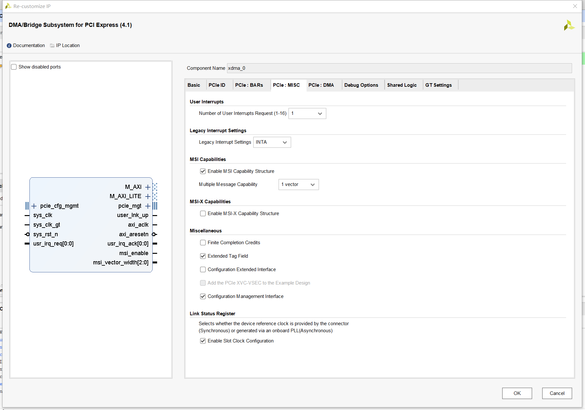
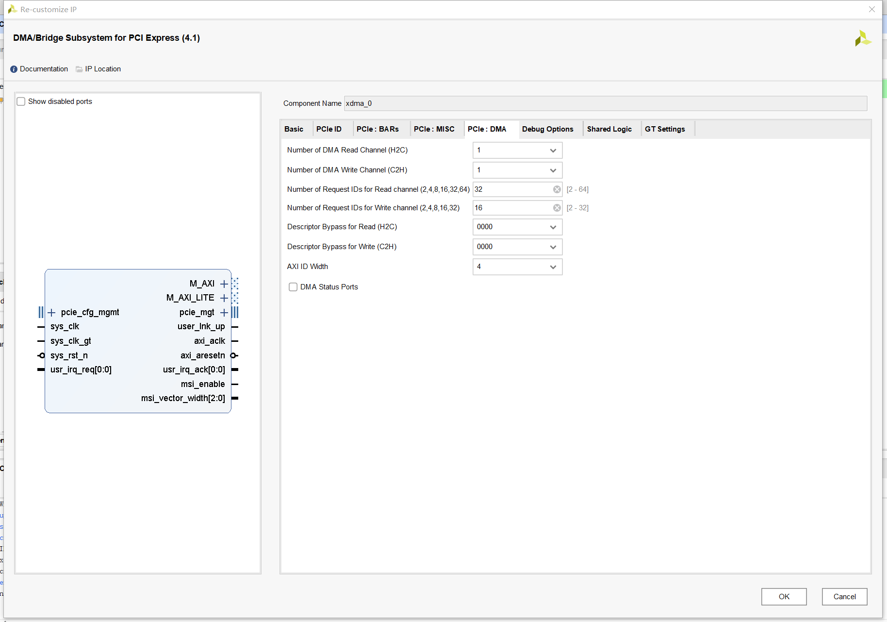
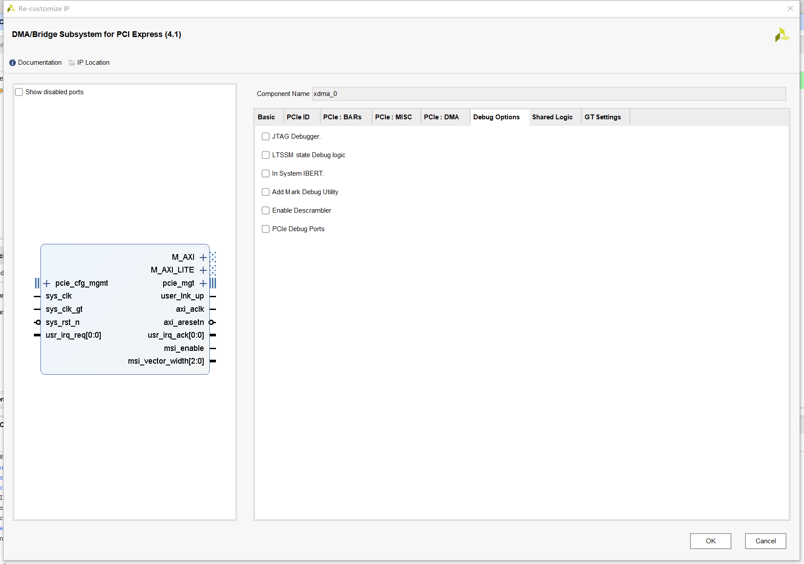
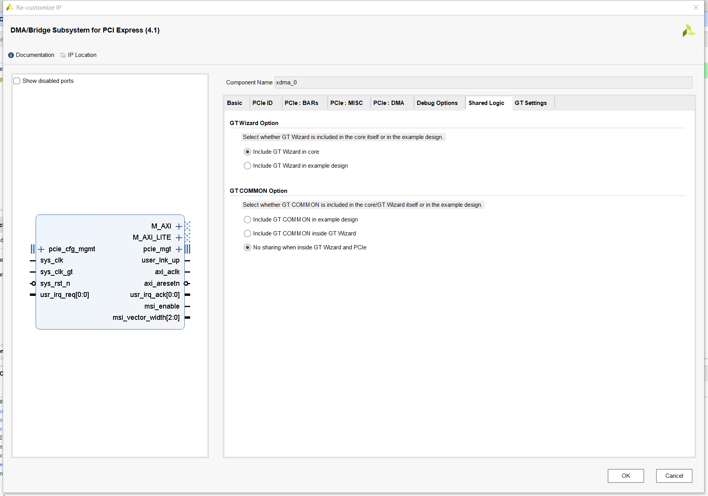
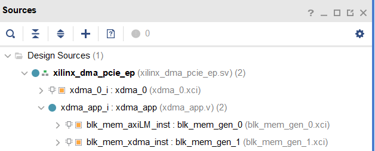

通过官方例程和官方驱动初步测试 XDMA IP 核。

测试软硬件环境：

- Vivado2021
- Kintex UltraScale+ FPGA
- PCIe3.0 x1

---

本文简单介绍 XDMA 基于官方 demo 的仿真和使用。

<!--more-->

### 一、添加 IP 核

新建工程，然后创建 block design，添加 XDMA IP 核，全称是DMA/Bridge Subsystem for PCI Express。

双击进入配置界面。

### 二、配置 IP 核

#### 2.1、Basic

这一界面需要根据实际也硬件连接来配置。如果需要调整 GT Quad，可以将 Mode 默认的 Basic 改为 Advanced。

这里将 PCIe 接口选择成与物理设计一致的 8GT/s、X1 lane。

AXI 接口的设计可以根据 PCIe 的速率来设置。例如，PCIe 的速度是 8Gb/s，而且 AXI 的Data Width 在当前 设置下只能选择 64bit，所以 AXI 时钟选为 125MHz，因为 64bit x 125MHz 刚好也是 8Gb/s。

DMA 的接口可以选择 AXI MM 或者 AXI Stream，这里先测试前者。

#### 2.2、PCIe ID

这一页可以保持默认，因为会用到 Xilinx 官方驱动 。这里的设计与官方驱动是对应的，否则如果修改了这里，还需要修改驱动。

#### 2.3、PCIe: BARs

BARs往往是用来存放一些配置信息的，在主机端和板卡端都有各自相对应的BAR空间，这两个BAR空间相互关联，即一方对自己的BAR空间写入数据时，另一方也会在自己的BAR空间中收到该数据，因此也要注意避免同时读写的问题。

pcie to axi translation 是从 PCIe 地址（主机地址）到 AXI 地址的映射。例如，将 pcie to axi translation 设为  0x80000000 时，当主机写入到 0x00000004 时，实际写入 AXI 地址为 0x80000000 + 0x00000004 = 0x80000004，反之做减法。

Value 是对11应的 Size 的编码值，用于初始化时换算空间大小（从官方例程的仿真代码中的 usp_pci_exp_usrapp_tx.v 中的 FNC_CONVERT_RANGE_TO_SIZE_32 函数可以看到这一过程）。

为了测试用于访问用户寄存器的 AXI Lite-Master 接口，这里勾选 PCIe to AXI Lite Master Interface，由于寄存器通常为 32bit，所以不勾选 64bit Enable。大小就用默认的 1M。

其他的设置暂时先不修改。

#### 2.4、PCIe: MISC

暂时不修改，只使用一个 User Interrupt。

#### 2.5、PCIe: DMA

先使用单通道，剩下的不改。

#### 2.6、Debug Options

暂时不改。

#### 2.7、Shared Logic

暂时不改。

#### 2.8、GT Settings

暂时不改。

### 3、导出例程

右键点击模块，选择 Open IP Example Design。会弹出对话框创建新的工程，选择目录即可。

生成的新工程中，顶层文件 xilinx_dma_pcie_ep 主要完成以下功能：

- 例化时钟 buffer
- 例化复位 buffer
- 例化前述配置的 XDMA IP 核
- 例化 xdma_app  模块

其中，xdma_app 模块的功能主要是为 XDMA 的 AXI-MM-Master 例化 64b x 512 的 BRAM，为 AXI-Lite-Master 接口例化 32b x 1024 的 BRAM。

修改 xdc 文件：

1）时钟

2）复位

未完待续。。。先写仿真再写硬件调试！

