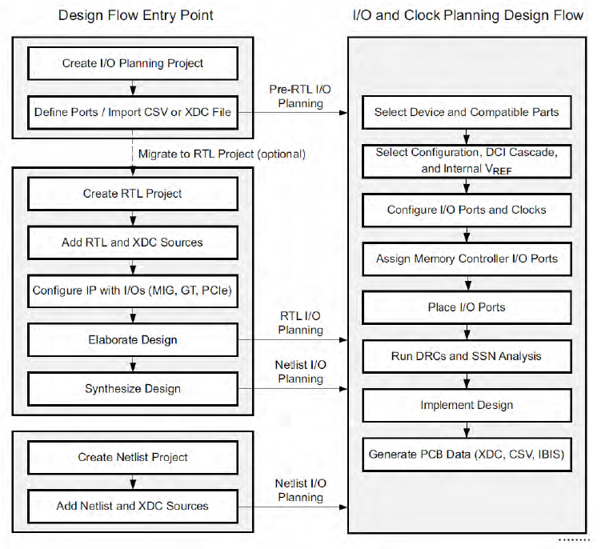

FPGA 设计中设计两种约束：物理约束和时序约束。

其中，物理约束常用的是：

- I/O 约束，包括位置和 I/O 标准
- 布局约束，例如单元位置
- 布线约束，例如固定布线
- 配置约束，例如配置模式

以下参考官方文档 UG903，介绍 Vivado 中使用 XDC 文件或 Tcl 脚本进行约束时的语法。

<!--more-->

大多数物理约束写法为：

```verilog
set_property <property> <value> <object list>
```


### 1、I/O 约束

包括电平约束、引脚约束和驱动能力等。

常用的约束命令有：

```verilog
# 管脚约束
set_property PACKAGE_PIN 管脚号 [get_ports {引脚名称}]
# 电平约束
set_property IOSTANDARD LVCMOS33 [get_ports {引脚名称}]
# 上拉约束
set_property PULLUP true [get_ports 引脚名称]
# 下拉约束
set_property PULLDOWN true [get_ports 引脚名称]
```

其他命令：

```verilog
# 驱动能力约束
set_property DRIVE <2 4 6 8 12 16 24> [get_ports {引脚名称}]
# 抖动约束
set_property SLEW <SLOW|FAST> [get_ports {引脚名称}]
# IN_TERM
# DIFF_TERM
# KEEPER
# PULLTYPE
# DCI_CASCADE
# INTERNAL_VREF
# IODELAY_GROUP
# IOB
# IOB_TRI_REG
```


### 8、网表约束 

网表约束设在网表对象上，例如 ports、pins、nets 或 cells，需要综合和实现以特殊的方式处理它们。

网表约束包括：

- CLOCK_DEDICATED_ROUTE
- MARK_DEBUG
- DONT_TOUCH
- LOCK_PINS


### 9、Vivado 中的约束

在 Vivado 中，可以在设计流的任意阶段做 I/O 和时钟规划。

Pre-RTL I/O Planning

RTL I/O Planning

Netlist I/O Planning




