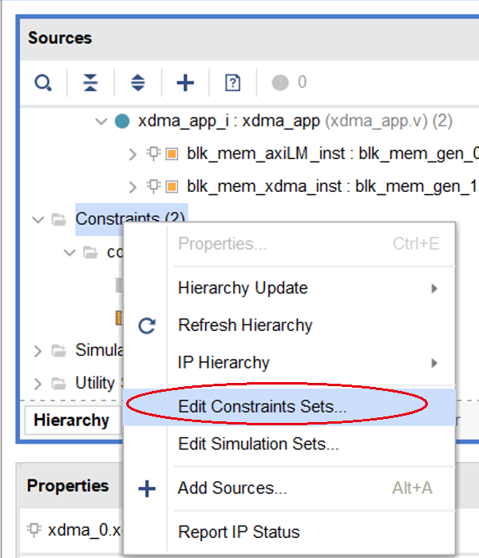
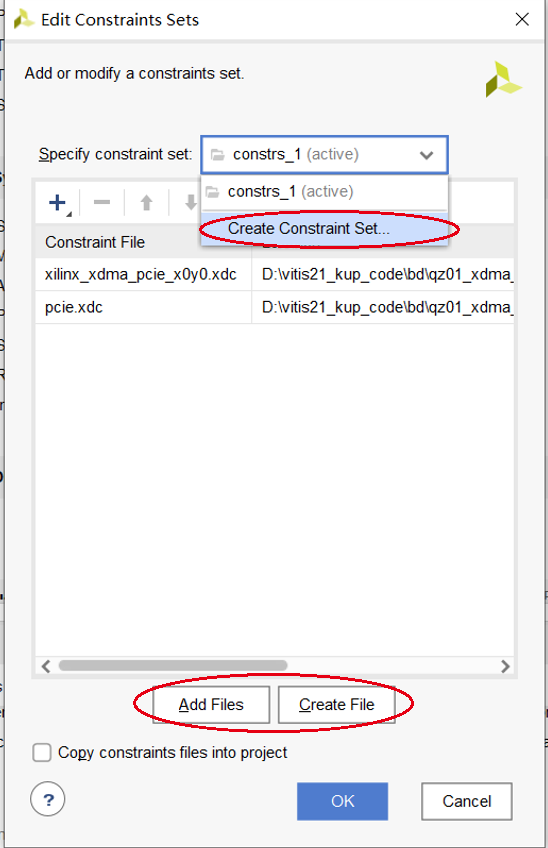
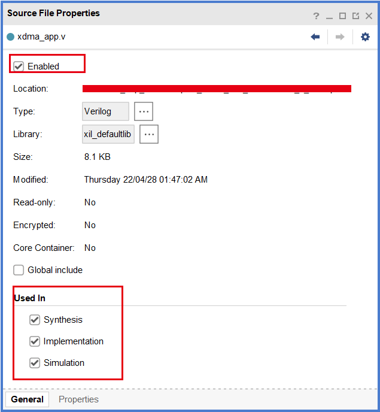

Xilinx 的 Vivado 软件使用 XDC（Xilinx Design Constraints）文件进行约束，XDC 相当于在标准的 SDC（Synopsys Design Constraints）约束格式的基础上，增加了与 Xilinx 硬件相关的一些约束。

<!--more-->

一个工程可以建立多个约束集，一个约束集可以含多个 XDC 文件或 tcl 脚本文件。在 Sources 栏的 Constraints 目录上右键选择 Edit Constraints Sets，即可管理约束集，可以增加约束集，也可以为某一个约束集增加或删减约束文件。

通常可以将物理约束和时序约束放在不同的 XDC 文件中，便于管理。

在文件属性界面，可以选择 XDC 文件是否使能和作用阶段：

