本文介绍 Xilinx XDMA IP 核配置中的各项参数，以 Kintex UltraScale+ 器件 XCKU5P为例，使用 Vivado2021.1 软件。

<!--more-->

从 IP Catalog 中输入 PCI，可见 Kintex UltraScale+ 器件共支持三种 PCIE IP 核：

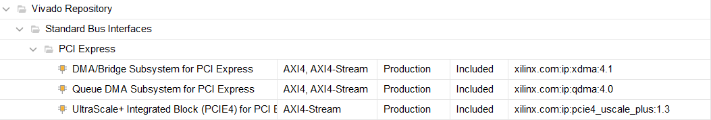

其中，第三项 UltraScale+ Integrated Block（PCIE4）for PCI Express 是最基础的 PCIe IP 核，直接封装了 FPGA 中的 PCIe 硬核，需要用户自己封装数据包，使用较为复杂。前两项都是对第三项的进一步封装。第一项 DMA/Bridge Subsystem for PCI Express 就是本文中的 XDMA。除 DMA 功能外，此 IP 还支持 AXI Bridge 功能。本文只详细介绍 DMA 功能的相关参数。

以下介绍 XDMA 配置中的各项参数。

---

### 1、Basic 

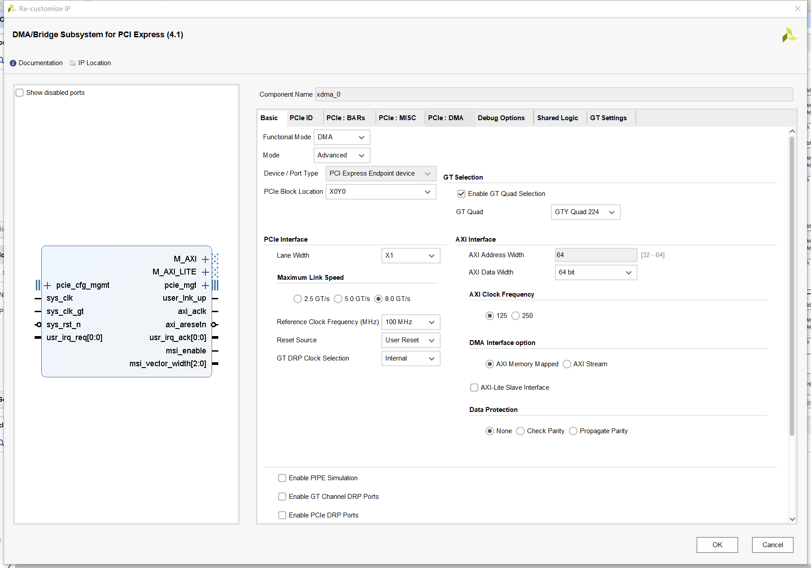

#### 1.1、基本选项

##### 1.1.1、Functional Mode

- DMA 
- AXI Bridge

AXI Bridge 仅对 Ultrascale+器件，具体可查看 PG194。

对于本文，应选择 DMA。

##### 1.1.2、Mode

- Basic
- Advanced

选择 Advanced 模式多出了以下设置选项：

- GT Selection：可以选择 PCIe 数据信号连接的 GT Bank。
- 页面最下方的程序加载相关设置

##### 1.1.3、Device/Port Type

DMA mode 下，只能选默认的 PCI Express Endpoint device；

AXI Bridge mode 下，还可以选 Root Port of Express Root Complex。

##### 1.1.4、PCIe Block Location

XCKU5P 只能选 X0Y0。Block location 离 PCIe 硬核的位置越近越好，详细可查看 PG213 的附录 B。

不同型号的器件支持的 Block Location 不同，有的器件有更多选择，可以查看 PG213 的 Chapter3。

##### 1.1.5、GT Selection

此选项在 Mode 选择 Advanced 时才会出现，用于选择 PCIe 的通道 0 所在的 GT 四通道。

勾选 Enable GT Quad Selection 后，可以选择GT Quad，否则默认使用 GTY Quad 227。

根据实际连接情况，选择是否调整 GT Quad。如果连接在其他 Quad 上，就在这里做调整。

关于硬件设计时 GT 位置如何选择的详细内容，可以参考 PG213 的附录 B。

#### 1.2、PCIe Interface

##### 1.2.1、Lane Width

UltraScale+ 系列都包含 PCIE4 块，在含 HBM（高带宽存储器）的 Virtex UltraScale+ 器件中同时包含 PCIE4 块和增强型的 PCIE4C 块。

PCIE4 和 PCIE4C 都支持 x1、x2、x4、x8、x16（根据 PG213），但不同的配置可选宽度不同，如 XCKU5P 的 GT Quad 选择 GTY Quad 224 时，不支持 x8 和 x16。

根据实际物理连接选择即可。

##### 1.2.2、Maximum Link Speed

可选 2.5 GT/s、5.0 GT/s、8.0 GT/s，分别对应 PCIe Gen1、Gen2、Gen3 的链路速度，根据实际链路情况选择即可。

提供 PCIE4C 块的器件支持 Gen4 的链路速度。

##### 1.2.3、Reference Clock Frequency（MHz）

可选 100、125、250MHz，需与实际的 PCIe 链路参考时钟一致（与 Tx/Rx 信号一起输入到 GT Channel 的伴随时钟）。

##### 1.2.4、Reset Source

- User Reset（用户复位）
- Phy ready（物理就绪）

建立链路后，用户复位来自于 PCIe 核。当 PCIe 链路中断时，“User Reset”会断言有效，且 XDMA 会转为复位模式。当链路恢复时，“User Reset”会断言无效。

选中“Phy ready”选项时，XDMA 不受 PCIe 链路状态影响。

##### 1.2.5、GT DRP clock Selection

- Internal
- external

选择内部时钟时，将使用 Reference Clock 作为 GT DRP clock。

选择外部时钟时，将使用外部自由时钟作为 GT DRP clock。

DRP，Dynamic Reconfiguration Port，即动态可重配置端口。由于 GT 可以工作在不同的线速率下，用户可能需要更改内部配置，需要用到 DRP 时钟。

通常选择默认的内部时钟即可。

当选中 “外部 (External)”时，将从 300 MHz 的外部时钟源提供 DRP 时钟，并且在赛灵思顶层模块中，该时钟将被分割 为 100/125 MHz。默认 GT DRP 时钟源为 Internal ，但在“附加调试选项 (Add. Debug Options)”页面 中启用“启用 In-System IBERT (Enable In System IBERT)”选项时，则默认为 external。（此段见 PG213 第五章）

#### 1.3、AXI Interface

##### 1.3.1、AXI Address width

只能选 64。

##### 1.3.2、AXI Data Width

与 Lane Width 和 Link Speed 的设置有关。例如，前面配置成 X1 8.0GT/s 时，这里只能选择 64bit。

有多个可选项时，需结合下面的 AXI Clock Frequency 来选择。

##### 1.3.3、AXI Clock Frequency

与 Lane Width 和 Link Speed 的设置有关。

当前面配置成 X1 8.0GT/s 时，AXI Data Width 只能选择 64bit，此时 AXI Clock 可选 125MHz 或 250MHz，计算方式为：

8Gb/s x 1 = 64b x 125MHz

左边是 PCIe 通道的带宽，右边是 AXI 通道带宽，因此 AXI Clock 应设为 125MHz。

##### 1.3.4、DMA Interface option

- AXI Memory Mapped
- AXI Stream。

二者只能选一种，不能不同的通道用不同的接口，需要慎重选择。AXI MM 用于对接 DDR、RAM 等有地址寻址的外设；AXIS 是流式接口，用于数据包、FIFO 流等。

勾选 AXI-Lite Slave Interface 可以启用 AXI4-Lite 从接口，用户逻辑可通过此接口访问 XDMA 的寄存器（不是 PCIe 集成块的寄存器）。此接口不会生成发射到主机的请求。

##### 1.3.5、Data Protection

- None

- Check Parity

- Propagate Parity

启用“Check Parity”时，XDMA 在读取来自 PCIe 的数据时执行奇偶校验检查，并在将数据写入 PCIe 时生成奇偶校验。

启用“Propagate Parity”时，XDMA 会将奇偶校验传输至用户 AXI 接口。用户负责在用户 AXI 接口上检查并生成奇偶校验。

#### 1.4、仿真调试相关设置

##### 1.4.1、Enable PIPE Simulation

使能 PIPE 模式仿真，此模式可提升仿真速度。

选中该选项时，可启用外部第三方总线功能模型 (BFM) 以连 接至 PCIe 的集成块的 PIPE 接口。欲知详情，请参阅《使用集成端点 PCI Express 块采用 Gen3 x8 和 Gen2 x8 配置 进行 PIPE 模式仿真》(XAPP1184)。（PG213）

具体参考 PG195 Chapter5 的仿真部分，以及 PG213 的相关内容。

使能后多了 pcie_ext_pipe_ep_usp 接口：

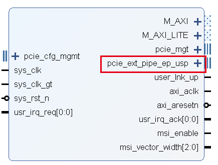

##### 1.4.2、Enable GT Channel DRP Ports

使能后多了 pcie_ext_ch_gt 接口，PG213 的附录 C 中有简单介绍，具体可能需要查看 GT 通道的相关资料。

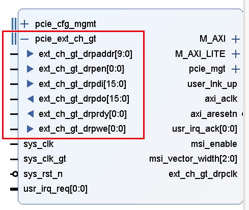

##### 1.4.3、Enable PCIe DRP Ports

PCI Express 安全 IP 模型不支持对 DRP 接口进行仿真。

使能后多了 drp 接口，PG213 的附录 C 中有简单介绍，详细使用方法暂未找到，可能需要查阅 IBERT、GT 的相关内容。

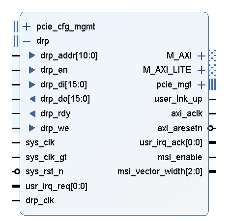

##### 1.4.4、Additional Transceiver Control and Status Ports

这些端口可用于调试收发器相关问题和 PCIe 相关信号，需要根据相应的 GT 用户指南进行驱动。（PG213）

使能后多了 pcie4_us_plus_transceiver_debug 接口：

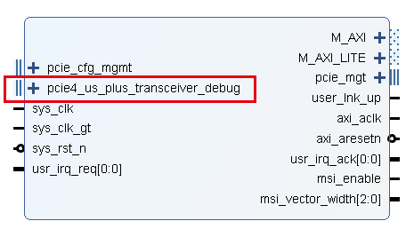

#### 1.5、程序加载相关设置

此部分内容需要将 Mode 设为 Advanced，才会在 Basic 页面的最下方显示。在 PG195 的第四章的串联配置部分和 PG213 的第四章的串联配置部分都有较为详细的资料。

##### 1.5.1、System Reset  Polarity

此参数用于将 sys_rst 的极性设置为 ACTIVE_HIGH 或 ACTIVE_LOW。通常设为低电平复位即可。

##### 1.5.2、Tandem Configuration  or Dynamic Function eXchange

PG213 第四章的串联配置部分有详细介绍，这里截取部分：

PCI Express 属于即插即用协议，即上电时，PCIe 主机将枚举系统。在此流程中，主机将从每个器件读取请求的地址大小，然后向器件分配基址。因此，当主机查询 PCIe 接口时，这些接口必须处于就绪状态，否则不会为其分配基址。 PCI Express 规范声明，当系统电源正常的 100ms 后，PERST# 必须断言无效，并且在 PERST# 断言无效后的 20ms 内 PCI Express 端口必须准备好进行链路训练。这通常被称为 100ms 启动时间要求。 

串联配置 (Tandem Configuration) 使用 2 阶方法以支持 IP 满足 PCI Express 规范中所述的配置时间要求。此技术支持多种用例，如下所述： 

- 串联 PROM（Tandem PROM）：从闪存加载单一 2 阶比特流。
- 串联 PCIe （Tandem PCIe）：从闪存加载第一阶段比特流，并通过 PCIe 链路将第二阶段比特流交付至 MCAP。
- 含现场更新的串联 PCIe（Tandem PCIe with Field Updates）：完成串联 PCIe 初始配置后，在 PCIe 链路保持有效时更新整个用户设计。更新区域（布 局图）和设计结构均已预定义，并且已提供 Tcl 脚本。 
    - 注释：在 UltraScale+™ 器件中，针对现场更新 (Field Updates)，必须使用串联 PCIe。串联 PROM 不支持现场更 新。
- 串联 + Dynamic Function eXchange：这是较常用的用例，针对任意大小或任意数量的动态区域采用串联配置后接 Dynamic Function eXchange（DFX）。
- 基于 PCIe 的 DFX （DFX over PCIe）：这是标准配置，后接 DFX，使用 PCIe/MCAP 作为部分比特流的交付路径。

##### 1.5.3、MCAP Bitstream Version register value

指定 MCAP 寄存器空间中的 MCAP 比特流版本寄存器的值。默认是 00000000，当在上一步的 Tandem Configuration 中使用了某一功能时，可以修改这个值。

### 2、PCIe：ID

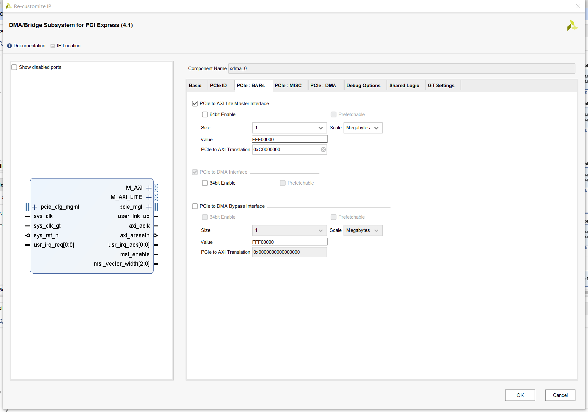

如果没有特殊需要，这一页可以不变。尤其是Vendor ID、Device ID，尽量不修改，因为Xilinx提供的驱动是对应这些 VID，DID 的。

#### 2.1、ID Initial Values

##### 2.1.1、Vendor ID

供应商编号，10EE 代表 Xilinx。

Vendor ID 不要修改。

##### 2.1.2、Device ID 

器件编号。9031 表示 UltraScale+ 系列，EP 接口，GEn3，X1 Lane。

第一位表示器件系列： 

- 9 —— UltraScale+
- 8 —— UltraScale
- 7 —— 7 系列  

第 2 位表示模式：

- 0 —— EP
- 1 —— RP

第三位表示链路速度：

- 1 —— Gen1
- 2 —— Gen2
- 3 —— Gen3
- 4 —— Gen4 

第四位表示链路宽度：

- 1 —— x1
- 2 —— x2
- 3 —— x4
- 4 —— x8
- F —— x16 

在官方驱动代码的 XDMA/linux-kernel/xdma_mod.c （官方驱动地址：[Xilinx/dma_ip_drivers: Xilinx QDMA IP Drivers (github.com)](https://github.com/Xilinx/dma_ip_drivers)）中有关于 Vendor ID 和 Device ID 的枚举。

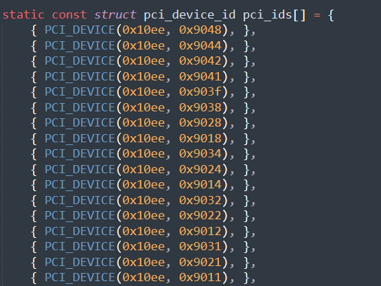

如果要新增自定义的 Device ID，除了在 Vivado 中设置，还要修改上述驱动文件中的 pci_ids[] 数组，增加相应的项。

##### 2.1.3、Revision ID

表示器件或应用的版本；作为器件 ID 的扩展。默认值为 00h；针对应用输入相应的值。

##### 2.1.4、Subsystem Vendor ID

子系统供应商 ID。进一步限定器件或应用的制造商。在此处输入子系统供应商 ID；默 认值为 10EEh。通常，该值与供应商 ID 相同。将该值设为 0000h 可能导致合规性测试出现问题。

##### 2.1.5、Subsystem ID

子系统 ID。进一步限定器件或应用的制造商。该值通常与器件 ID 相同；默认值取决于所选通道宽度和链路速度。将该值设为 0000h 可能导致合规性测试出现问题。

##### 2.1.6、Enable PCIe-ID Interface

如果选中该参数，那么根据选中的 PFx 数量，在核顶层边界处会显 示 PCIe ID 端口 cfg_vend_id、cfg_subsys_vend_id、cfg_dev_id_pf*、cfg_rev_id_pf* 和 cfg_subsys_id_pf*，并可供用户逻辑驱动。如未选中该参数，则不会在顶层显示这些端口，并根据自定义时设 置的值来驱动这些端口。

在 PG213 中有关于 PF IDs 的详细介绍，可以设置多个 PF ID，但是在 XDMA 的配置页面没有关于 PF ID 的内容，貌似 PCIe ID 界面的各项 ID 就对应 PG213 中的 PF0。

#### 2.2、Class Code Lookup Assistant

类代码（Class Code）用于识别器件的常规功能，Class
Code 寄存器可供系统软件识别当前PCI 设备的分类。分为以下 3 个字节大小的字段：

- 基本类（Base Class）：用于广泛识别器件执行的功能类型，将设备分类为显卡、网卡、PCI 桥等设备
- 子类（Sub-Class）：进一步具体识别器件功能
- 接口 (Interface)：用于定义特定寄存器级别编程接口（如果有），允许不从属于器件的软件与器件进行连接。

在 [PCI-SIG](https://pcisig.com/) 网站上提供了类代码编码。

具体可以查看 PG213 的第五章的 PF IDs 选项卡，但是没有介绍的太详细。PG213 中可以配置多个 PF，但是 PG195 第二章关于功能的描述中提到，XDMA 只支持 1PF。

作为非通用设备，这部分可以不做改动。如果需要使用，可能需要查阅 PCIe 的标准手册。

以下不做具体介绍。

##### 2.2.1、Use Class Code Lookup Assistant

勾选后看起来影响不大。

##### 2.2.2、Base Class Menu

提供了多种设备类型，与 Base Class Value 一一对应。

##### 2.2.3、Base Class Value

与 Base Class Menu一一对应，默认是 0x07（Simple communication  controllers）。

##### 2.2.4、Sub Class Interface Menu

提供了多种子类型，与 Sub Class Value 一一对应。

##### 2.2.5、Sub Class Value

与 Sub Class Interface Menu 一一对应。修改 Base Class Value 时默认值会变。

##### 2.2.6、Interface Value

与 Base Class Menu 和 Sub Class Interface Menu 有关，修改这两者默认值会变。

##### 2.2.7、Class Code

由 Base Class Value、Sub Class Value 和 Interface Value 组合而成，共 6 位 16进制数，如默认的 0x070001。

### 3、PCIe：BARs

XDMA 最多支持三个 32 位或 64 位 BAR（PG195 第三章）：

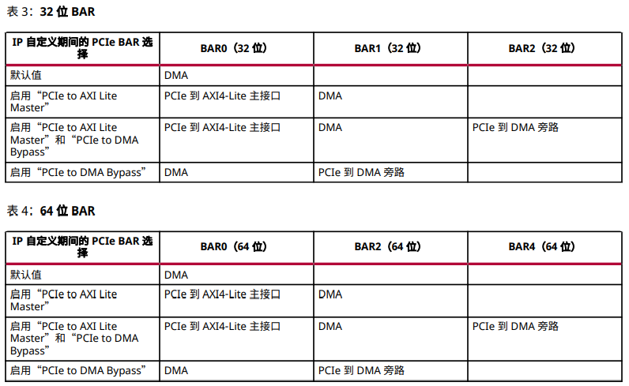

#### 3.1、PCIe to AXI Lite Master Interface

AXI-Lite Master 接口用于访问 32bit 位宽用户逻辑寄存器。

有博客说这个接口的地址不是全给用户的，有一部分要给 XDMA 寄存器？？？

##### 3.1.1、64bit Enable

打勾后 BAR 空间为 64 位。

32 位 BAR 的地址空间最小可达 128 字节或者最大可达 2 千兆字节 (GB)。用于内存或 I/O。

64 位 BAR 的地址空间最小可达 128 字节或者最大可达 8 艾字节 (EB)。仅用于内存。当 BAR 设为 64 位时，它使用下一个 BAR
作为扩展地址空间，并使下一个 BAR 不可访问。

##### 3.1.2、Prefetchable

用于预取内存空间。

每个 64 位 BAR 空间均可选择是否可预取。

##### 3.1.3、Size and Scale

Size 和 Scale 合起来表示 AXI-Lite master 接口的映射空间的大小。

##### 3.1.4、Value

Value 与 前面的 Size 和 Scale 是一一对应的，当修改空间大小时，Value 也会相应地改变。

在生成的仿真代码中，找到 usp_pci_exp_usrapp_tx.v（不同的软件版本或硬件型号可能这里的明明不一样，找 usrapp_tx 相关的文件就行）：

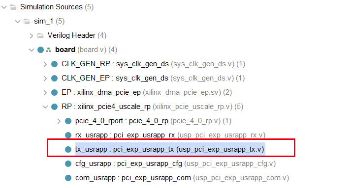

里面的函数 FNC_CONVERT_RANGE_TO_SIZE_32 就是用来完成从 Value 值到映射空间范围的转换。

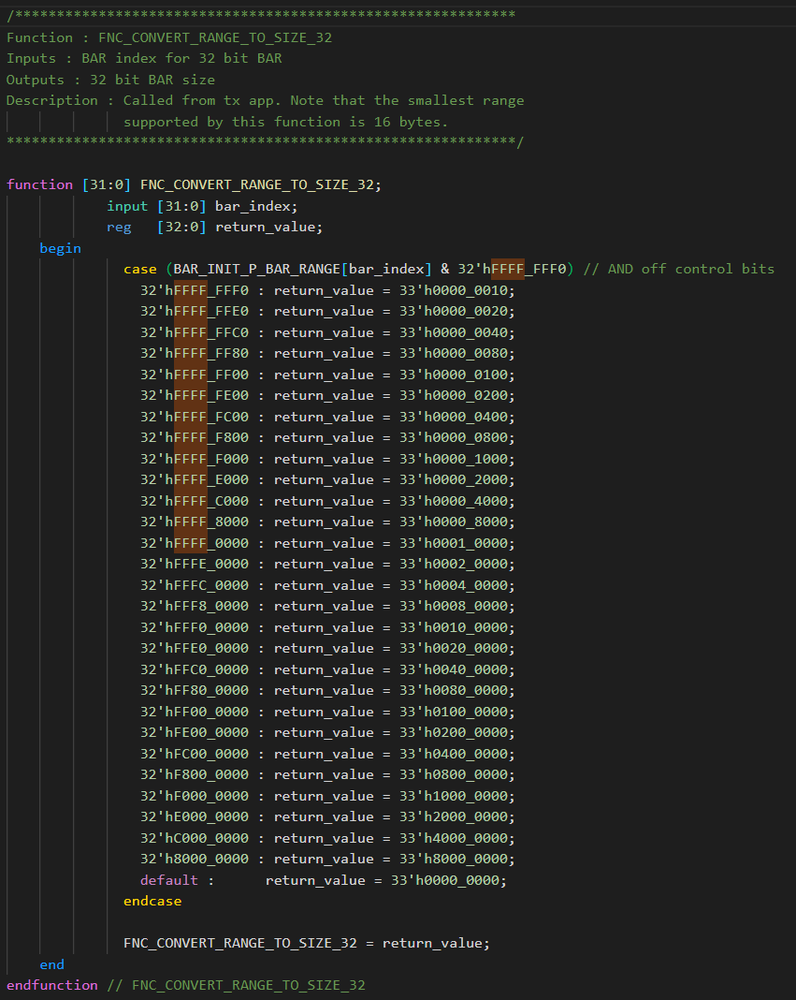

可以对照一下，Vivado 中设为 1M 大小时，Value 值自动变化为 FFF00000，与上述函数中的 33'h0010_0000（1M） 正好对应。

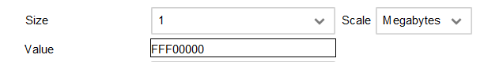

##### 3.1.5、PCIe to AXI Translation

主机访问地址与 AXI 映射地址不同，PCIe to AXI Translation 用于主机访问地址与 AXI 地址之间的映射。

AXI 地址 = BAR 地址 + 这里设置的偏置。

例如，PCIe to AXI Translation 设为 0xC0000000 时，主机向 0x0000008 地址写入数据时，AXI 接口实际写入 0xC0000008 地址。

#### 3.2、PCI to DMA Interface

默认使能，因为是 XDMA 的主要功能，可实现最多 4 个 H2C/C2H 通道。可以选择是否使能 64bit BAR 及预取功能。

#### 3.3、PCIe to DMA Bypass Interface

到达 PCIe 到 DMA 旁路 BAR 的主机请求都将被发送到此模块。旁路主端口属于 AXI4 MM 接口，支持读写访问。

可配置的内容与 3.1 中 AXI-Lite Master 接口的内容相同，这里不再重复。

### 4、PCIe：MISC

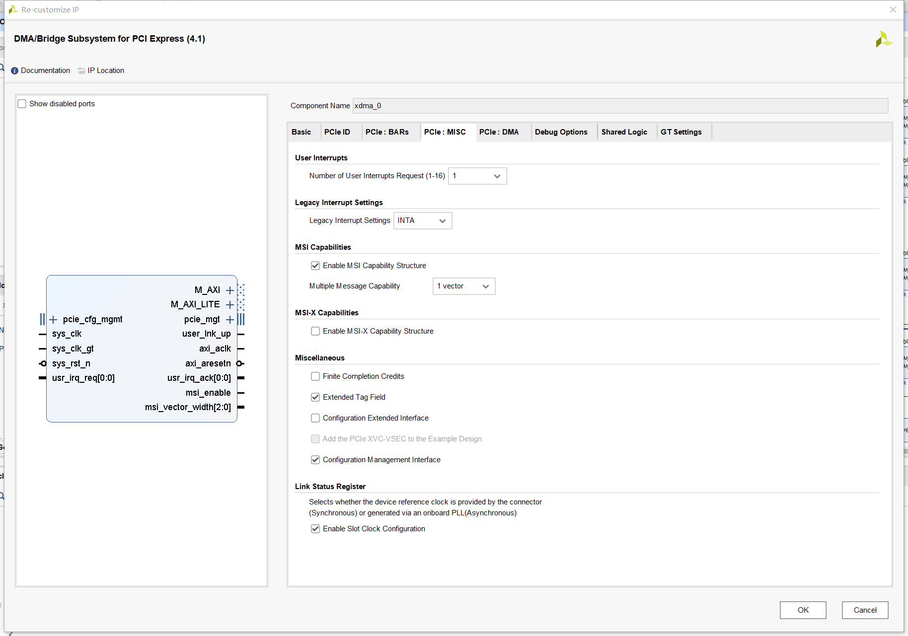

MISC 指 Miscellaneous（其它）。

XDMA 的 IRQ 模块会接收到来自用户逻辑的中断连线，其数量可配置，每个 DMA 通道 1 条中断连线。此模块负责基于 PCIe 生
成中断。可在 IP 配置期间指定对 MSI-X、MSI 和传统中断的支持：

- Legacy 中断，共享式
- MSI 中断，最多支持 32 个中断向量，且要求中断向量连续
- MSI-X 中断，可以支持更多中断请求，不要求中断向量连续

主机可在 IP 配置期间从指定的受支持中断列表中启用 1 个或多个中断类型。IP 在任意给定时间仅生成 1 种类型的中断，即使启用多个中断类型也是如此。

**MSI-X 中断优先于 MSI 中断，MSI 中断优先于传统中断。**

当存在任一已断言有效或暂挂的中断时，主机软件不得切换（启用或禁用）中断类型。

关于三种中断的信息，可以查阅 PG195 的第三章的 IRQ 模块和附录 A 的中断处理章节。

对于7系列：MSI 中断和 MSI-X 中断只能选择一个，否则会报错。如果选择了 MSI 中断，可以选择 Legacy 中断。如果选择了 MSI-X 中断，则 Legacy 必须选择 None。UltraScale+ 系列没有这个限制。

#### 4.1、User Interrupts

可选 1~16 个用户中断。调整这里的数量，usr_irq_req 和 usr_irq_ack 的位宽会相应变化，如设为 10 时：

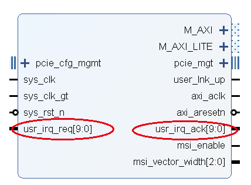

这里的用户中断是从用户逻辑产生的通知 CPU 的中断，不包含 XDMA 本身产生的中断。

用户逻辑必须使 usr_irq_req 保持处于高电平有效状态（即使接收到 usr_irq_ack (acks) 后也是如此），以使中断暂挂寄存器保持断言有效。这样即可支持驱动程序内的中断服务例程 (ISR) 判定中断源。当驱动程序接收用户中断后，驱动程序或软件即可通过断言 usr_irq_req 无效来将硬件应响应的用户中断源复位。

#### 4.2、Legacy Interrupt Settings

可以在四个传统中断 INTA、INTB、INTC 或 INTD 中任选一个，或都不选（None）。

#### 4.3、MSI Capabilities

默认启用“MSI Capabilities”，并启用 1 个矢量。可选矢量最大数量为 32。

一般情况下，Linux 针对 MSI 仅支持 1 个矢量，Xlinx 的 Linux 也仅支持 1 个 MSI 矢量。

该选项可禁用。

#### 4.4、MSI-X Capabilities

可以使能 MSI-X 事件。

对于 MSI-X，DMA 支持最多 32 个不同中断源，MSI-X 由最多 16 个可用 DMA 中断矢量和最多 16 个可用用户中断矢量组成。

#### 4.5、Miscellaneous

##### 4.5.1、Finite Completion Credits

有限完成信用值。

在支持有限完成信用值的系统上，可启用该选项以改善性能。

##### 4.5.2、Extended Tag Field

扩展标签字段。

默认情况下使用 6 位完成标签。对于 UltraScale™ 和 Virtex®-7 器件，“扩展标签 (Extended Tag)”选项可提供 64 个标签。对于 UltraScale+™ 器件，“扩展标签 (Extended Tag)”选项可提供 256 个标签。如果不选中“Extended Tag”，DMA 会针对所有器件使用 32 个标签。

##### 4.5.3、Configuration Extend Interface

配置扩展接口。

可选择 PCIe 扩展接口以增加配置空间。选中“Configuration
Extend Interface”时，由用户负责添加接口扩展逻辑以使其正常工作。

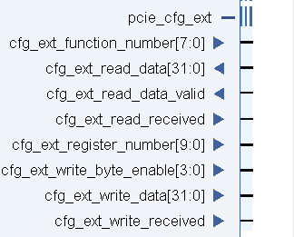

##### 4.5.4、Configuration Management Interface

配置管理接口。

选中该选项时，即可将 PCIe 配置管理接口置于顶层。

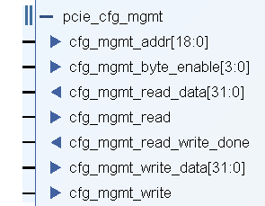

#### 4.6、Link Status Register

链路状态寄存器。默认情况下，选中“Enable Slot Clock Configuration”。这意味着在链路状态寄存器中启用插槽配置位。

### 5、PCIe：DMA

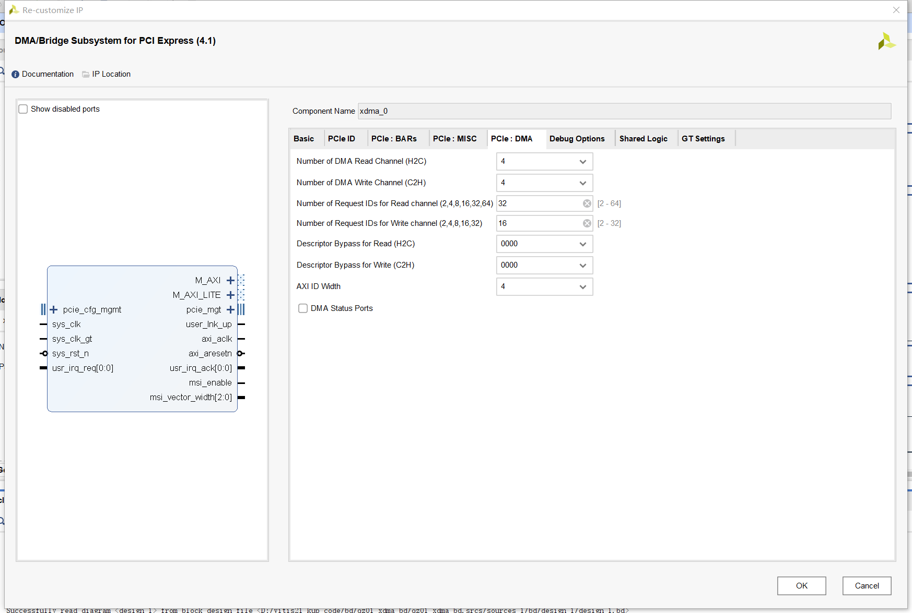

DMA 通道数、ID 等的选择。根据实际的业务来选择。例如有 4 路 ADC 数据传输，可以选择 C2H 为 4，当然，也可以 4 路ADC数据在 FPGA 内合并后成 1 路，然后只选择 C2H 为 1 。

#### 5.1、DMA 参数说明

##### 5.1.1、Number of DMA Read Channels（H2C）

DMA 读取通道数，可选 1-4。

选择 AXI 接口时，多个 DMA 通道共用一个 AXI 信道。

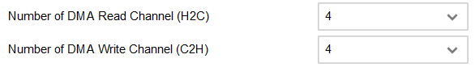

选择 AXI-Stream 接口时，每个 DMA 通道都有一个独立的信道。

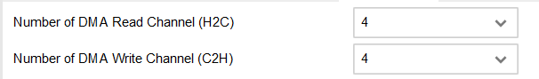

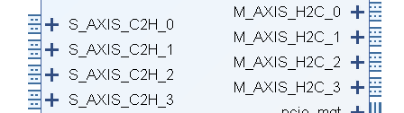

DMA 读取指 DMA 从主机读取，所以是 H2C，AXI-Stream 接口为 master 接口。

##### 5.1.2、Number of DMA Write Channels（C2H）

DMA 写入通道数，可选 1-4。

##### 5.1.3、Number of Request IDs for Read channel

读取通道的请求 ID 数。选择每个通道未完成的请求的最大数量。可用选项范围为 2 到 64。

##### 5.1.4、Number of Request IDs for Write channel

写入通道的请求 ID 数。选择每个通道未完成的请求的最大数量。可用选项范围为 2 到 32。

##### 5.1.5、Descriptor Bypass for Read（H2C）

用 4 位 2 进制数表示，默认是 0000。

对应读取的描述符旁路。可用于所有选定的读取通道。每个二进制数字均对应于 1 条通道。LSB 对应于通道 0。位元位置的值为 1 表示对应的通道已启用描述符旁路。

##### 5.1.6、Descriptor Bypass for Write（C2H）

用 4 位 2 进制数表示，默认是 0000。

可用于所有选定的写入通道。每个二进制数字均对应于 1 条通道。LSB 对应于通道 0。位元位置的值为 1 表示对应的通道已启用描述符旁路。

##### 5.1.7、AXI ID Width

AXI ID 宽度。默认位宽为 4 位。也可以选择 2 位。

AXI ID 和前面的 Request IDs 的关系？？？？

##### 5.1.8、DMA Status port

使能 DMA 状态端口，可用于所有通道。

#### 5.2、其他

### 6、Debug Options

#### 6.1、调试参数说明

##### 6.1.1、JTAG Debugger

该选项用于启用 JTAG 调试。

##### 6.1.2、LTSSM State Debug Logic

该选项可显示从链路建立开始后执行的所有 LTSSM 状态转换。

##### 6.1.3、In-System IBERT

该选项用于检查串行链路的眼图，确认该链路是否按期望的链路速度运行。如需了解有关 In-System IBERT 的更多信息，可参阅《In-System IBERT LogiCORE IP 产品指南》(PG246)。

##### 6.1.4、Add Mark Debug Utility

该选项可通过 mark_debug 属性添加预定义的 PCIe 信号，以便在 ILA 中添加这些信号用于调试。

##### 6.1.5、Enable Descrambler

该选项在 PCIe 核内集成解扰器模块的加密版本，用于对采用 Gen3 链路速度模式往来 PCIe 集成块的 PIPE 数据进行解扰。

##### 6.1.6、PCIe Debug Ports

启用该选项后，下列端口即可用：

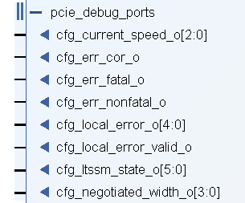

#### 6.2、其他

### 7、Share logic

以下复制于 PG213 第五章。

#### 7.1、GT Wizard Option

可选择在设计示例中包含 GT Wizard，然后 GT Wizard IP 将被添加到设计示例区域中。用户可重新配置 IP 以便进一步进行测试。

默认情况下，在 PCIe IP 核中，GT Wizard IP 将作为层级 IP 交付，用户无需对其进行重新自定义。如需获取信号描述及其它详细信息，可参阅《UltraScale 架构 GTY 收发器用户
指南》(UG578) 或《UltraScale 架构 GTH 收发器用户指南》(UG576)。

#### 7.2、GT Common Option

该选项用于共享设计中使用的 GT COMMON 块，前提是选中 Gen2 （对应 PLL 选择为“QPLL1”）和 Gen3 链路速度。

当选中“Include GT COMMON in example design”时，将在支持封装中提供 GT COMMON 块实例，此支持封装位于赛灵思顶层文件内，并且可供核或外部逻辑使用。

使用“Include GT COMMON inside GT Wizard”时，GT COMMON 可供外部逻辑共享。

选中“No Sharing when inside GT Wizard and PCIe”时，不允许共享 GT COMMON 块。

同时选中“Include GT COMMON in example design”和“Include GT Wizard in example design”时，必须使用来自相同配置的 GT Wizard IP 的设计示例工程的最新 GT COMMON 设置。此特定选项用于交付静态 GT COMMON 封装，其中包含仅适用于 2017.3 时间范围的最新设置。

### 8、GT Settings

#### 8.1、GT 设置说明

##### 8.1.1、Enable Auto RxEq

启用自动接收方均衡。当此参数设置为 True 时，它会自动选择“接收方均衡 (Receiver Equalization)”模式（LPM 或 DFE）。

- True：默认值为 DFE，但将根据信道特性更改为 LPM。 
- False：默认值为 DFE 且可通过设置“外形尺寸驱动的插入损失调整 (Form Factor Driven Insertion Loss Adjustment)”来进行更改。

##### 8.1.2、Form Factor Driven Insertion Loss Adjustment

表示根据外形尺寸选择，以奈奎斯特频率运行时发射器到接收器的插入损失。其中提供了 3 个选项：

- 芯片到芯片 (Chip-to-Chip)：值为 5 dB。

- 插卡 (Add-in Card)：这是默认选项，值为 15 dB。

- 背板 (Backplane)：值为 20 dB。

此插入损失值适用于 GT Wizard 子核。

##### 8.1.3、 Link Partner TX Preset

链路合作伙伴 TX 预置。默认值为 4，不建议更改。对于部分系统，预置值 5 可能更适合。在“GT 设置 (GT Settings)”选项卡上提供了此参数以供使用。

##### 8.1.4、Disable GT Channel LOC Constraint

这一参数手册中没有说明。从字面意思来看，勾选后将不对 GT Channel 做物理约束，此时用户应手动约束。

#### 8.2、其他

---

参考资料：

PG213

PG195
