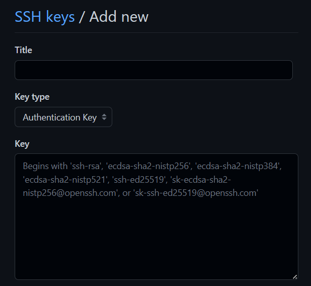

本系列介绍如何使用 Hexo+github pages 搭建个人博客。

本文中首先介绍 github 的相关设置。

<!--more-->

---

### O、安装 git 客户端

从 [Git (git-scm.com)](https://git-scm.com/) 下载并安装 git，具体安装过程不熟悉的话可以自行搜索。

注意安装过程中勾选上 Git Bash Here，方便使用。

安装成功后，鼠标右键菜单里会出现 Git Bash Here，即可从任意目录进入 git bash 环境。


### 一、创建 github 仓库

新建一个名为 {github 用户名}.github.io 的仓库。例如，github 用户名是 xyz，则新建仓库的名字为 xyz.github.io。这个地址就是用来访问博客的域名，每个 github 账户只能建一个这样的仓库作为域名。

另外，如果不想使用这个默认域名，也可以绑定自己的其他域名，具体的绑定方法请自行搜索。


### 二、配置 SSH key

SSH key 用于连接 git 服务器。


如果已经生成过，则在 C:\Users\{用户名}\.ssh 目录下有密钥文件（id_rsa.pub）。


如果此前没有配置过，直接打开 git bash 环境，输入

`ssh-keygen -t rsa -C "邮件地址"  // 邮件地址是 github 账户`

连续按 3 次回车，最终会在用户目录（C:\Users\{用户名}\）下生成 .ssh\id_rsa.pub。打开这个文件，复制里面的内容。


再打开 github 页面，点击右上角的头像，选择 Settings，点击左侧的 SSH and GPG keys，点击 New SSH key，将复制的内容粘贴到 Key 一栏，Title 一栏可以随意填写（最好能体现是自己哪一台电脑，方便管理）。




添加完成后，在 git bash 环境下输入：

`ssh -T git@github.com`

收到提示：

`Are you sure you want to continue connecting (yes/no)?`

输入 yes，看到

`Hi {github 用户名}! You've successfully authenticated, but GitHub does not provide shell access.`

说明配置成功。


最后将 github 账户的配置级别设置为全局级别。

```shell
git config --global user.name "github 注册用户名" // 注意不是昵称
git config --global user.email "github 注册邮箱"
```

这样在任意位置进行 git 连接，都是指向 github 账户。如果有其他代码仓库的使用需求（例如 gitlab），可以将一个账户设置为全局，另一个设置为仓库级别（仓库级别的优先级最高）。


至此，github 相关的设置就完成了。


