使用 Hexo 部署博客时，用到的 node.js 版本比较低，但是做其他开发可能会用到更高版本的 node.js。因此，为了方便在不同版本间切换，可以使用 nvm 来管理和切换不同版本的 node.js。

Hexo 使用 12.18.3 亲测可行。

参考链接：[windows中如何将已安装的nodejs高版本降级为低版本](https://blog.csdn.net/weixin_44582077/article/details/110237056)

<!--more-->

---

### 一、删除本地安装的 node.js

打开命令行，输入 where node，查看现有 node.js 的安装路径。

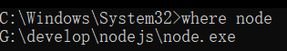

如果用的是 windows terminal，就输入 whereis node。

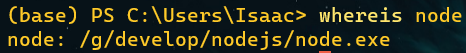

可以先从控制面板里卸载 node.js，卸载成功的话，这个 nodejs 文件夹应该会直接移除。如果没有，可以手动删除。

### 二、安装 nvm

从 [Releases · coreybutler/nvm-windows (github.com)](https://github.com/coreybutler/nvm-windows/releases) 下载 nvm 安装包：

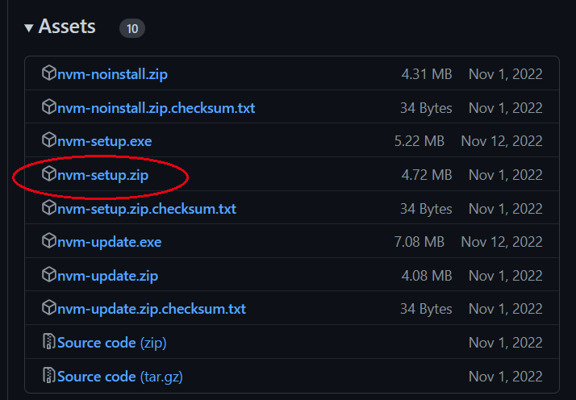

任意位置解压后，运行解压出来的 nvm-setup.exe。

选择 nvm 的安装位置：

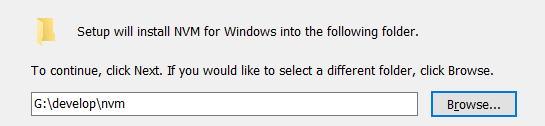

选择 node.js 的安装位置：

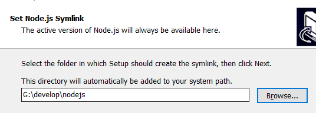

安装完成后，在命令行中输入 nvm v，检验是否安装成功。

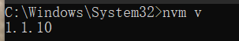

### 三、安装 node.js

这里以安装 12.18.3 和 18.14.0 两个版本为例。

输入 nvm ls available 查看可用的 node.js 版本。

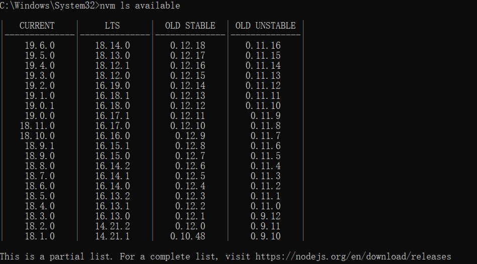

这里只列出来一部分，完整版本可以查看图中给出的链接。

先安装 12.18.3：

`nvm install 12.18.3`

安装完成后，首先输入

`nvm use 12.18.3`

这样会自动配置环境变量，否则看不到 node 和 npm 版本。

然后用 node -v 和 npm -v 查看相应版本：

但是出现以下错误：

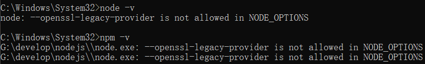

查看环境变量，发现 NODE_OPTIONS 环境变量的值为 --openssl-legacy-provider

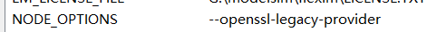

将其修改为一个空格即可正常显示：

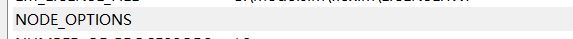

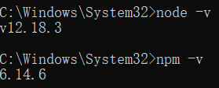

然后安装 18.14.0。

`nvm install 18.14.0`

安装完成后，首先输入 nvm ls 查看已安装版本：

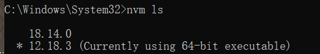

可以看到，两个版本都已安装上了，前面带星号表示正在使用的版本。

想要切换到 18 版本，输入

`nvm use 18.14.0` 

即可。

如果想卸载某个版本，就使用 nvm uninstall {版本号}。例如：

`nvm uninstall 18.14.0`
