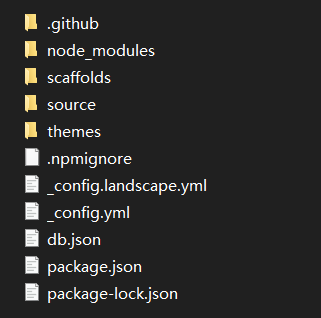
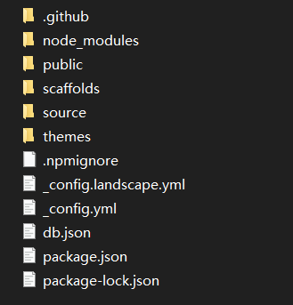
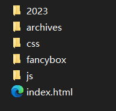

本系列介绍如何使用 Hexo+github pages 搭建个人博客。

本文中整体介绍 Hexo 工程框架。

<!--more-->

Hexo 工程根目录如下图所示：

其中：

node_modules 文件夹用于存放 Hexo 需要的 node.js 模块，新安装的插件也存放在这里。

scaffolds 文件夹存放了几个模板，通过 hexo new（或 hexo n） 命令来创建新文件时就调用这里相应的模板。

source 文件夹用于存放源文件，即博客正文的 md 文件。

- _post 文件夹下存放正式发布的 md 源文件（对应命令 hexo new <title>）
- _draft 文件夹存放 md 草稿，不会显示在发布的页面中（对应命令 hexo new draft <title>）
    - 可以通过 hexo publish <title> 将草稿移动到 _post 文件夹下
    - 也可以通过 --draft 参数来预览草稿，即 hexo g -s --draft
- hexo new page 命令创建的文件直接存放在 source 文件夹下（与 _post 同级）,也可以通过 -p 指定路径

thmes 文件夹用于存放主题文件

_config.yml 是站点的全局配置文件

db.json 是缓存文件

package.json 是项目的依赖包信息

执行 hexo g 命令生成页面后，工程根目录下会出现 public 文件夹

里面存放着生成的静态页面的内容

再输入 hexo s 即可通过浏览器预览页面了。

更新 hexo 工程配置、更换主题、添加源文件等操作之后，通过 hexo g -s 命令即可在本地通过浏览器预览新生成的页面。

此时，页面只是在本地显示，还不能通过 github.io 域名访问，后面将会介绍如何实现。
