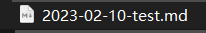
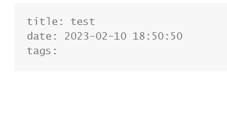
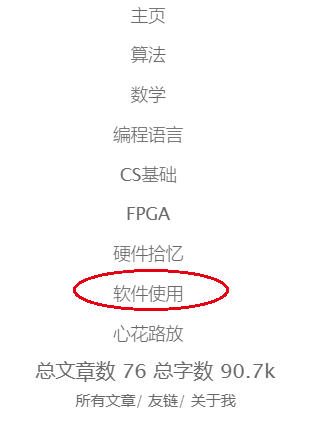
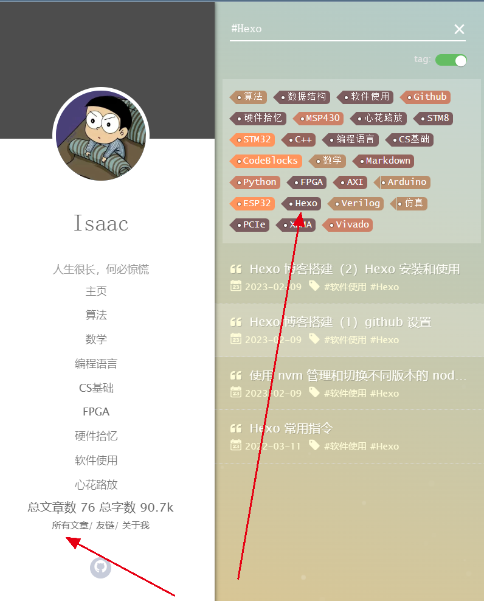
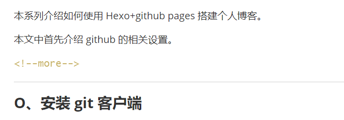
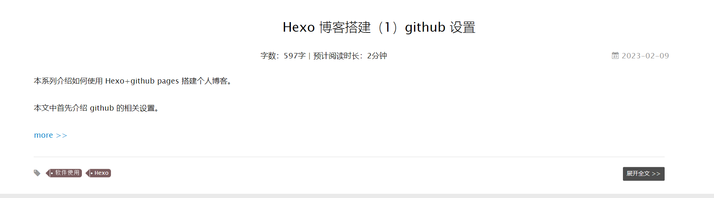

本系列介绍如何使用 Hexo+github pages 搭建个人博客。

本文中介绍如何用 Hexo 写博客正文。

<!--more-->

在 Hexo 工程根目录下打开 Git Bash 环境，输入：

`hexo n “博客标题”`

就会在 source/_post 文件夹下生成相应的 md 文件，其内容与 scaffolds 文件夹下的 post.md 模板一致。


例如输入：

`hexo n “test”`

则在 source/_post 文件夹下生成了



打开后的界面是：



可以在 tags 下填写目录标签和普通标签。

如果在 yilia 的 _config.yml 中设置了目录，则这里添加目录标签后，就会出现在页面中相应的目录下。另外也可以添加普通标签，会出现在所有文章列表中对应的标签下。例如：

```markdown
tags：
  - 软件使用
  - Hexo
```

”-“ 前面空两格，”-“ 后面空一格。

经过部署后，在最终页面里，点击目录中的 “软件使用” 就能看见这一篇文章。



点击 “所有文章”，打开 tag 开关，可以点击 “Hexo” 标签看到这篇文章。




如果不加设置，默认会将整篇文章显示出来，如果想要折叠文章，只显示前面几行，可以在正文里需要折叠的位置另起一行，输入

`<!--more-->`

例如：



显示效果为：




内容编辑方面参考 markdown 语法即可。


